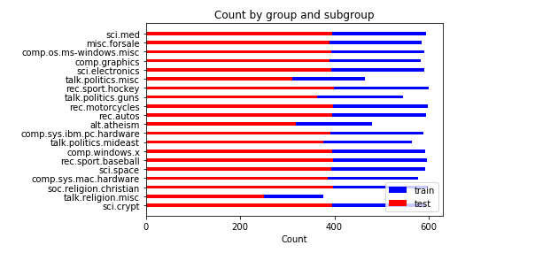

## 3. 输入数据

问题中涉及的数据集包括下述 2 份

### 3.1 [text8]

#### 3.1.1 数据来源

这是 gensim 在训练 word2vec 中[所建议的一份数据](https://radimrehurek.com/gensim/models/word2vec.html#gensim.models.word2vec.Text8Corpus)。这是一份[对原始的英文维基百科于 2006 年 3 月 3 日的 dump 文件进行清洗后得到的数据](http://www.mattmahoney.net/dc/textdata.html)。

> 具体的清洗步骤，将在第 7 部分（设计大纲）中进行说明

#### 3.1.2 数据特征

text8 数据集具备下述特征

1. 文本中只包含：由小写字母 a-z 组成的单词、单一空格（将不在 a-z 之间的字符也一律转换为空格）
2. 也就是说，text8 中的文本对于后续工作而言已经比较干净
3. 词库中包含 17005207 个单词

该数据将用于训练词向量（词袋模型的离散型词向量，或词嵌入模型的连续型词向量），从而实现对文本数据的规范表示。（这也是上述第 2 点中提到的「后续工作」）

#### 3.1.3 样本展示

如下为 text8 中前 200 字节：

```
 anarchism originated as a term of abuse first used against early working class radicals including the diggers of the english revolution and the sans culottes of the french revolution whilst the term
```

### 3.2 [20 Newsgroups]

#### 3.2.1 数据来源

已经有学者已经[将 18000 条新闻文本分为 20 类主题](http://www.qwone.com/~jason/20Newsgroups/)，并提供了多种版本的新闻包以便下载。本项目中选取了其中[经过整理、分割为训练集与测试集的新闻包](http://www.qwone.com/~jason/20Newsgroups/20news-bydate.tar.gz)。

#### 3.2.2 数据特征

20 Newsgroups 具备如下特征：

+ 每条新闻均被研究人员标注为 20 个主题中的一个
+ 总数据集包含 18846 条新闻，总共被分割为 2 个子集：
    + 训练集（占总数据 60%）
    + 测试集（占总数据 40%）
+ 剔除了跨主题的新闻（即任何一份新闻都只在单一主题下），提出了新闻组相关辨认标识（如 Xref, Newsgroups, Path, Followup-To, Date）
+ 对于文本处理而言仍不够干净：除了由小写字母 a-z 组成的单词、单一空格以外，还有一些标点符号，如 `@`、`.`、`*` 等。因此在最终训练前，需要对该数据进行清洗。

> 具体的清洗步骤，将在第 7 部分（设计大纲）中进行说明

数据集在 20 类别上的数据如下图所示：



我们可以看到有大约 3 个类的文本相对其他类来说明显较少，不过也可以看到：以训练集数据为例，这些类别大约都有 400 份数据，大约占大多数训练数据量的 66.67%。要判断这样的不均衡是否可接受，我们还要看看各类别中测试数据占训练数据的比例：


可以看到每个类别内部，测试数据与训练数据的比重非常稳定，正如数据提供者所说的，原始数据中训练数据大约占了 60%，测试数据占了 40%，该说法正好与图上的统计数据吻合。因此各分类内部没有明显的数据不均衡现象，均可用于正常的训练和测试。

项目将采用训练集来训练文本分类器，使用测试集来最终评估分类器的效果。

#### 3.2.3 样本展示

如下为其中的一份训练样本：

```txt
Organization: University of Illinois at Chicago, academic Computer Center
From: <U19250@uicvm.uic.edu>
Subject: Re: Foreskin Troubles
Lines: 3

This is generally called phimosis..usually it is due to an inflammation, and ca
n be retracted in the physician's offfice rather eaaasily.  One should see a GP
, or in complicated cases, a urologist.
```

如下为其中的一份测试样本：

```txt
Subject: CALCIUM deposits on heart valve
From: john.greze@execnet.com (John Greze)
Distribution: world
Organization: The Executive Network Information System
Lines: 6


A friend, a 62 year old man, has calcium deposits on one of his
heart valves .   What causes this to happen and what can be done about
it?

John.Greze@execnet.com
```
