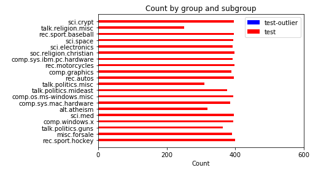

# 毕业项目：基于语料 *20 Newsgroups* 的自动文档分类系统设计

[TOC]

## I. 问题的定义

### 1. 项目概述

。。。

### 2. 问题陈述

本项目将试图创建一个文本分类系统，最终能对来自语料 *20 Newsgroups* 数据集的测试集上、共计 20 个类别的文本进行正确的归类。具体而言，创建文本分类系统主要包括：

1. 选择合适的文本表示模型。待选的表示模型包括词袋模型（Bag-of-Words）、词嵌入模型（Word Embedding），这两种方法都会对输入的文本进行一定处理，输出为数据形式，以便后续使用。
2. 选择合适的分类器。从机器学习的角度看，该项目是典型的有监督学习问题，待选的分类器包括支持向量机（SVM）、随机森林（Random Forest）、普通深度神经网络（DNN）、卷积神经网络（CNN），任一指定的分类器都将从上一步骤中获得的数据进行训练（即机器学习）。训练后的分类器将可直接用于分类。

由于待训练文本总计有超过 18,000 条，考虑项目的执行环境，若不事先分析数据集，而直接在完整数据集上进行完整的研究，一旦出现大问题，将浪费较多时间。因此本项目将分为 5 个阶段来进行：

1. 全数据集进行统计分析、可视化分析
2. 在训练集上建立文本表示模型 Word2Vec，并用它来表示文档
3. 在训练集上训练基于 Word2Vec 表示的文档，训练文本分类器
4. 在测试集上用上述训练出的分类器实际执行分类任务
5. 参数调整与模型验证

## 3. 评估指标

综合考虑下述 2 个指标：

+ $F_{1}$：$F_{1} = \frac{2PR}{P+R}$
+ $t_{all}$：$t_{all} = t_{train} + t_{test}$

我希望训练得到一个分类效果较好、且总体建模时间（无论是训练还是测试）相对较短的分类器。显然，$t_{all}$ 的意义较容易理解；而使用 $F_{1}$ 衡量的意义则在于，同时考虑了查准率（Precision） $P = \frac{TP}{TP + FP}$（实际为真、预测为真的样本，占所有预测为真的样本的比例） 与查全率（Recall） $R = \frac{TP}{TP + FN}$（实际为真、预测为真的样本，占所有实际为真的样本的比例），从而在这两个矛盾的指标上取得一定的平衡，平衡方式是给予两个指标同等权重。

## II. 分析

### 1. 数据的探索

问题中涉及到数据集 *20 Newsgroups*，以下探索该数据集。

#### 1.1 数据来源

已经有学者已经[将 18000 条新闻文本分为 20 类主题](http://www.qwone.com/~jason/20Newsgroups/)，并提供了多种版本的新闻包以便下载。本项目中选取了其中[经过整理、分割为训练集与测试集的新闻包](http://www.qwone.com/~jason/20Newsgroups/20news-bydate.tar.gz)。

#### 1.2 数据特征

*20 Newsgroups* 具备如下特征：

+ 每条新闻均被研究人员标注为 20 个主题中的 1 个（即任何样本的分类都是单一的）
+ 总数据集包含 18846 条新闻，总共被分割为 2 个子集：
    + 训练集（占总数据 60%）
    + 测试集（占总数据 40%）
+ 剔除了跨主题的新闻（即任何一份新闻都只在单一主题下），提出了新闻组相关辨认标识（如 Xref, Newsgroups, Path, Followup-To, Date）
+ 对于文本处理而言仍不够干净：除了由小写字母 a-z 组成的单词、单一空格以外，还有一些标点符号，如 `@`、`.`、`*` 等。因此在最终训练前，需要对该数据进行清洗。

#### 1.3 样本展示

如下为其中的一份训练样本：

```txt
Organization: University of Illinois at Chicago, academic Computer Center
From: <U19250@uicvm.uic.edu>
Subject: Re: Foreskin Troubles
Lines: 3

This is generally called phimosis..usually it is due to an inflammation, and ca
n be retracted in the physician's offfice rather eaaasily.  One should see a GP
, or in complicated cases, a urologist.
```

如下为其中的一份测试样本：

```txt
Subject: CALCIUM deposits on heart valve
From: john.greze@execnet.com (John Greze)
Distribution: world
Organization: The Executive Network Information System
Lines: 6


A friend, a 62 year old man, has calcium deposits on one of his
heart valves .   What causes this to happen and what can be done about
it?

John.Greze@execnet.com
```
### 2. 探索性可视化

以下对语料 *20 Newsgroups* 进行可视化。数据集在 20 类别上的数据如下图所示：


我们可以看到有大约 3 个类的文本相对其他类来说明显较少，不过也可以看到：以训练集数据为例，这些类别大约都有 400 份数据，大约占大多数训练数据量的 66.67%。要判断这样的不均衡是否可接受，我们还要看看各类别中测试数据占训练数据的比例：


可以看到每个类别内部，测试数据与训练数据的比重非常稳定，正如数据提供者所说的，原始数据中训练数据大约占了 60%，测试数据占了 40%，该说法正好与图上的统计数据吻合。因此各分类内部没有明显的数据不均衡现象，均可用于正常的训练和测试。

项目将采用训练集来训练文本分类器，使用测试集来最终评估分类器的效果。由于训练时是依次读入文本的，而相邻的文本大多具备相同类别，除了那些在交界处的文本（即本类别内最后一份文本、下一类别的第一份文本）。为了避免分类器训练时倾向于后出现的类别，需要在训练前打乱训练数据。

考虑到各种特殊符号（例如：标点符号、换行符等）与单词的组合可能会使训练量过大，因此需要在正式训练前对文本进行预处理，即使用在 [text8 数据提供者提供的清洗 Wikipedia dump 的脚本](http://mattmahoney.net/dc/textdata) 基础上修改过的脚本，同样对 *20 Newsgroups* 数据集进行处理：清除其他所有字符，只保留由小写字母 a-z 组成的单词、单一空格（将不在 a-z 之间的字符也一律转换为空格）。处理之后，对各文档进行词汇量统计，可视化结果如下：


可以看到在共计 18846 份文本中，大部分文本的词汇量在 0-6699 之间，最多为 33449，最少为 12。词汇量超过 6699 的文本为 59 份，占比约为 0.0031，不足 0.5%。同时，列出这 59 份文本在各类别中的分布图（分别列出测试集与训练集中异常点的分布图）：




显然即便分散到各个分类中，所占比例仍然极小，肉眼不可见。列出其具体分布如下表：


可以看到：最多的异常点分布在训练集的 `comp.os.ms-windows.misc` 分类中。这些异常点占该部分数据的比例为：


显然，仍然只占对应数据集约 3%。因此可以放心地认为：从而先验地认为这些数据不足以对结果产生足够坏的影响，因此不予移除。

统计显示，经清洗的文本含有 6095997 个单词。显然，有可能需要考虑去除掉一些过分频繁出现或出现过少（如只出现 1 次）从而对学习文档特征帮助不大的词汇。首先列出文本中最常见的 30 个单词如下图所示：


可以看到这些单词对于分类而言几乎不具备意义，例如 the、to、of 等。像这些词语，可以考虑在建立表示模型时作为「停用词」（[stop words](https://en.wikipedia.org/wiki/Stop_words)）被剔除，从而减少减少计算量，这有可能优化算法性能；具体是否有效果，可通过后续实验研究得知。

### 3. 算法和技术

这里主要探讨文本预处理后的文本表示模型算法、分类算法及相关技术。关于数据预处理，将在本文「III. 方法」中的「1. 数据预处理」提及。

#### 3.1 表示模型算法

本项目试图尝试的表示模型算法为：基于词向量（词嵌入，word embedding）Word2Vec 的表示模型。

传统的文档表示方法是词袋模型（Bag-of-Words, BOW），虽然简单易懂，然而这种模型至少存在 3 个问题：

1. 维度过大：导致计算量太大
2. 噪音太多：有一些信息对于分类而言完全没必要
3. 过分稀疏：词袋表示几乎完全无法体现词汇意义之间的关联

基于词袋模型，有一些方法例如[潜在语义分析（Lament Semantic Analysis, LSA）](https://en.wikipedia.org/wiki/Latent_semantic_analysis)试图解决传统的词袋模型的 3 个问题；而另外有一种思路则不基于「计数」（如传统的词袋模型），而是试图直接为每个单词学习一些参数，参数量远低于词汇量，再用这些参数值表达的词汇来表达文档，这就是词嵌入（词向量）模型，其中一种模型称为 Word2Vec。

Word2Vec 采用无监督学习算法，对每个词语学习一定数目的参数，用这些参数来表示词语。这种算法基于一种简单的思想，即：在相似上下文中出现的词语具有相似的意思；所谓「上下文」，即邻近目标词前后位置的若干词。

。。。补图 skip-gram 和 cbow

Word2Vec 在计算嵌入的参数时有 2 种算法：Skip-gram（从目标词预测上下文） 和 CBOW（从上下文预测目标词）。本文采用了默认的 skip-gram 方法。

理论上，使用 Word2Vec 训练出的模型，在[词语联想预测任务](https://www.tensorflow.org/tutorials/word2vec#evaluating_embeddings_analogical_reasoning)上将表现良好，例如能够探测到 $ king - queen \approx father - mother$这样的关系。

词向量训练完毕后，需要对这些词向量进行一定的组合与处理，从而得到基于词向量的文档表示。受文献 [Convolutional Neural Networks for Sentence Classification](http://www.aclweb.org/anthology/D14-1181) 的启发，本项目将对于每一篇文档，遍历其中所有词语，将这些词语的词向量进行相加；若遇到未学习过的词语，则加上固定的常量替代，例如零向量。最后，将得到的和向量对文章中的已学词语数求均值，用这样得到的均值向量来表示文档。

#### 3.2 分类算法

本项目试图尝试的分类算法有 2 大类，共 3 种：

1. 传统机器学习算法
  1. 支持向量机（Support Vector Machine, SVM）
  2. 随机森林（Random Forest）
2. 神经网络算法

以下简单介绍各方法的优缺点：

1. SVM
  + [优点](https://mp.weixin.qq.com/s?__biz=MzA5ODUxOTA5Mg==&mid=2652549761&idx=1&sn=a51404d92418a25b3a2389cd35fffad7&scene=24&srcid=0828KO5LOZDyi8wXi9tsM3N2&pass_ticket=sjY%2BX5DxmxBcEFvXQDXbNAoDfOWD6yDF7YnwYatGdmEyI3SLnzCPcYOZruYNmGft#rd)：
    - 可以解决高维问题，即大型特征空间
    - 能够处理非线性特征的相互作用
    - 无需依赖整个数据集，[因此不需要太大内存](http://www.36dsj.com/archives/35477)
  + [缺点](https://mp.weixin.qq.com/s?__biz=MzA5ODUxOTA5Mg==&mid=2652549761&idx=1&sn=a51404d92418a25b3a2389cd35fffad7&scene=24&srcid=0828KO5LOZDyi8wXi9tsM3N2&pass_ticket=sjY%2BX5DxmxBcEFvXQDXbNAoDfOWD6yDF7YnwYatGdmEyI3SLnzCPcYOZruYNmGft#rd)
    - 当观测样本很多时，效率并不是很高
    - 对非线性问题没有通用解决方案，有时候很难找到一个合适的核函数
    - 对缺失数据和噪声敏感
2. RandomForest
  + 优点
    - 比起单棵决策树，减少了过拟合
    - 容易实现，计算开销小
  + 缺点
    - 不如单棵决策树容易解释
    - 属于 Bagging 方法，主要关注降低方差而非偏差
3. 神经网络
  + 优点
    - 特别适合于处理语言、图像等非结构化数据，性能优越
    - 适合多种类型的数据处理
  + 缺点
    - 缺乏严格的理论基础，「黑箱」模型，难以解释
    - 容易过拟合
    - 计算量比一般分类器大

#### 3.2 技术

本项目使用了下述工具：

1. [scikit-learn 机器学习工具包](http://scikit-learn.org/stable/)：用于训练分类器 `SVM`、`RandomForest`、神经网络
3. [gensim](https://radimrehurek.com/gensim/)：用于训练词向量 Word2Vec 模型（使用 Skip-gram 方法）
4. [NLTK](http://www.nltk.org/)：用于选出常用词，以便在建立词袋模型需要剔除单词时使用

各模型的参数将在后续实验中陆续确定。

### 4. 基准模型

许多研究者已经在 *20 Newsgroups* 数据集上进行了试验，但由于 Word2Vec 是 2013 年新提出的工具包，因此就 google 学术搜索结果而言，利用 Word2Vec 在该数据集上进行分类试验的研究论文还相对较少。选取了其中一篇 [*Using Word2Vec to Process Big Text Data*](https://www.researchgate.net/profile/Long_Ma15/publication/291153115_Using_Word2Vec_to_process_big_text_data/links/569fe12008aee4d26ad285e4.pdf)作为参考：该研究同样以 gensim 训练词向量，给出了基于 SVM（线性核）的一组结果如下：


实际训练时，由于计算资源有限，将不参考上表所示的第 1 组数据，即不计算 61189 维的词向量；作为替代，本文将尝试 5000 维词向量。

我选择了同样多的分类任务，并挑选了 `SVM`、`RandomForest`、神经网络算法。预计 `SVM` 的实现效果与基准相差不大，而考虑到文本分类任务中常使用支持向量机，因此预计 `RandomForest`、神经网络算法的效果可能会比现有结果差。

## III. 方法

### 1. 数据预处理

首先使用在 [text8 数据提供者提供的清洗 Wikipedia dump 的脚本](http://mattmahoney.net/dc/textdata) 基础上修改过的脚本对原始的[经过整理、分割为训练集与测试集的 *20 Newsgroups* 新闻包](http://www.qwone.com/~jason/20Newsgroups/20news-bydate.tar.gz)进行清洗。相比原始脚本，修改地方为：注释掉 `while (<>) {`以下 3 行以使其不起作用，并在 `while (<>) {` 下第 4 行加入了 `{`。修改原因是：原始脚本是为了清洗来自 Wikipedia dump 的 HTML 数据，而这里的 *20 Newsgroups* 数据是直白的文本，因此可直接将清洗过程应用到文本上。经修改的脚本如下：

```perl
#!/usr/bin/perl

# Program to filter Wikipedia XML dumps to "clean" text consisting only of lowercase
# letters (a-z, converted from A-Z), and spaces (never consecutive).  
# All other characters are converted to spaces.  Only text which normally appears 
# in the web browser is displayed.  Tables are removed.  Image captions are 
# preserved.  Links are converted to normal text.  Digits are spelled out.

# Written by Matt Mahoney, June 10, 2006.  This program is released to the public domain.

$/=">";                     # input record separator
while (<>) {
#  if (/<text /) {$text=1;}  # remove all but between <text> ... </text>
#  if (/#redirect/i) {$text=0;}  # remove #REDIRECT
#  if ($text) {
{
    # Remove any text not normally visible
    if (/<\/text>/) {$text=0;}
    s/<.*>//;               # remove xml tags
    s/&amp;/&/g;            # decode URL encoded chars
    s/&lt;/</g;
    s/&gt;/>/g;
    s/<ref[^<]*<\/ref>//g;  # remove references <ref...> ... </ref>
    s/<[^>]*>//g;           # remove xhtml tags
    s/\[http:[^] ]*/[/g;    # remove normal url, preserve visible text
    s/\|thumb//ig;          # remove images links, preserve caption
    s/\|left//ig;
    s/\|right//ig;
    s/\|\d+px//ig;
    s/\[\[image:[^\[\]]*\|//ig;
    s/\[\[category:([^|\]]*)[^]]*\]\]/[[$1]]/ig;  # show categories without markup
    s/\[\[[a-z\-]*:[^\]]*\]\]//g;  # remove links to other languages
    s/\[\[[^\|\]]*\|/[[/g;  # remove wiki url, preserve visible text
    s/\{\{[^}]*\}\}//g;         # remove {{icons}} and {tables}
    s/{[^}]*}//g;
    s/\[//g;                # remove [ and ]
    s/\]//g;
    s/&[^;]*;/ /g;          # remove URL encoded chars

    # convert to lowercase letters and spaces, spell digits
    $_=" $_ ";
    tr/A-Z/a-z/;
    s/0/ zero /g;
    s/1/ one /g;
    s/2/ two /g;
    s/3/ three /g;
    s/4/ four /g;
    s/5/ five /g;
    s/6/ six /g;
    s/7/ seven /g;
    s/8/ eight /g;
    s/9/ nine /g;
    tr/a-z/ /cs;
    chop;
    print $_;
  }
}

```

经过上述脚本清洗后的文本，将只剩下：由小写字母 a-z 组成的单词、单一空格（将不在 a-z 之间的字符也一律转换为空格；所有数字将也被转换为单词）。由 gensim 或 TensorFlow 编写的词向量训练器将直接在经过该脚本预处理后的文本上进行训练，以学到嵌入参数。

### 2. 执行过程

这里主要分为 2 大步骤：

1. 在训练集上：建立文档表示模型
2. 在训练集上：训练文本分类器
3. 在测试集上：执行实际分类任务

对于步骤 1，详述如下：

1. 使用 gensim 为词汇建立 Word2Vec 模型
2. 使用平均向量法来表示文档

对于步骤 2，详述如下：

使用 SVM 时，

对于步骤 3，详述如下：

。。

### 3. 完善

由于要构建的文本分类系统主要包含了「表示模型」核「分类器」两个部分，因此相应地，要改善结果，有 2 种思路：

1. 改善表示模型对文本的表示效果
2. 改善分类器对文本的分类效果

#### 3.1 改善表示模型

主要参数 | 取值
--------|---------
特征数目 | 784
迭代次数 | 15
负采样数(\*) | 。。。
词窗口大小(\*) | 5
初始学习率 | 。。。
线程数 | 12

(\*)注：

1. 负采样数：负采样时所采样的负样本数。
2. 词窗口大小：每次训练时，以目标词为中心，所要考虑的邻近单词数。例如当词窗口大小为 5 时，对目标词而言，「上下文」指该词前 2 个单词与该词后 2 个单词。


#### 3.2 改善分类器

对于支持向量机，。。。

对于随机森林，。。。

对于神经网络，。。。

## IV. 结果

### 1. 模型的评价与验证


### 2. 合理性分析


## V. 项目结论

### 1. 结果可视化


### 2. 对项目的思考


### 3. 需要作出的改进


## 主要参考文献

1. 西瓜书。。。
2. 李航。。。统计学习


---------------------

## 4. 解决办法

0. 【数据预处理】将待训练集和测试集的文本进行同样的清洗，即
    + 
1. 【特征抽取与文本表示】从文本数据集中抽取表示文本所需的特征，然后在文本数据集上用这些抽取出的特征重新表示文本数据集，包括
    + 使用**TF-IDF** 方法抽取特征，建立表示模型 1，包括如下步骤：
    + 使用**词嵌入**（Word embedding）方法（在这里，具体使用 Doc2Vec）抽取特征，建立表示模型 2
2. 【分类器训练】对已经建立的表示模型，在每个模型上分别使用一些有监督学习方法在训练数据上分别训练出一定数量的分类器，包括这 3 种分类器训练模型：
    + SVM（支持向量机）
    + 朴素贝叶斯分类器
    + 神经网络
3. 【性能评估】对上述分类器进行如下评估：
    1. 对于上述每种表示模型：比较同一文本表示模型下不同训练方法的训练效果
    2. 在每种表示模型的语境下各选出分类效果最好的那个分类器，并进行比较
    3. 评估指标见下


## 6. 基准模型

ch6

## 7. 设计大纲

ch7
