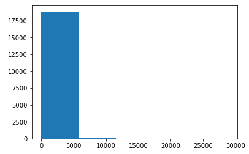
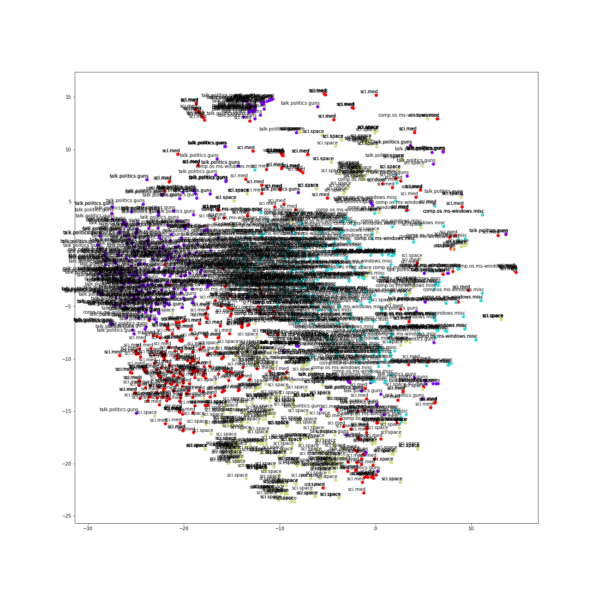

# 毕业项目：基于语料 *20 Newsgroups* 的自动文档分类系统设计

[TOC]

## I. 问题的定义

### 1. 项目概述

文本分类是[文本挖掘](https://en.wikipedia.org/wiki/Text_mining)中的一种典型任务。[《基于机器学习的文本分类技术研究进展》一文](http://www.jos.org.cn/ch/reader/create_pdf.aspx?file_no=20060902&journal_id=jos)中这样介绍文本分类：「随着信息技术的发展，互联网数据及资源呈现海量特征。为了有效地管理和利用这些分布的海量信息，基于内容的信息检索和数据挖掘逐渐成为备受关注的领域。其中，文本分类（text categorization，简称 TC）技术是信息检索和文本挖掘的重要基础，其主要任务是在预先给定的类别标记（label）集合下，根据文本内容判定它的类别。文本分类在自然语言处理与理解、信息组织与管理、内容信息过滤等领域都有着广泛的应用。20世纪90年代逐渐成熟的基于机器学习的文本分类方法，更注重分类器的模型自动挖掘和生成及动态优化能力，在分类效果和灵活性上都比之前基于知识工程和专家系统的文本分类模式有所突破，成为相关领域研究和应用的经典范例。」同时，该文也介绍到了用于文本分类的若干机器学习方法，如朴素贝叶斯、$k-NN$、神经网络、支持向量机等。

本项目将探索基于机器学习的文本分类方法：具体而言，将针对语料 *20 Newsgroups* 设计一个文本分类系统，系统基于该数据集中的部分数据训练而成，并对来自该数据集的另一部分文本进行自动文本分类。数据集中包含了来自 20 个不同分类共计超过 18000 份短文本，其中每份文本有且仅有 1 个类别。

### 2. 问题陈述

本项目将试图创建一个文本分类系统，最终能对来自语料 *20 Newsgroups* 数据集的测试集上、共计 20 个类别的文本进行正确的归类。具体而言，创建文本分类系统主要包括：

1. 选择合适的文本表示模型。待选的表示模型包括词袋模型（Bag-of-Words）、词嵌入模型（Word Embedding），这两种方法都会对输入的文本进行一定处理，输出为数据形式，以便后续使用。
2. 选择合适的分类器。从机器学习的角度看，该项目是典型的有监督学习问题，待选的分类器包括支持向量机（SVM）、随机森林（Random Forest）、普通深度神经网络（DNN）、卷积神经网络（CNN），任一指定的分类器都将从上一步骤中获得的数据进行训练（即机器学习）。训练后的分类器将可直接用于分类。

由于待训练文本总计有超过 18,000 条，考虑项目的执行环境，若不事先分析数据集，而直接在完整数据集上进行完整的研究，一旦出现大问题，将浪费较多时间。因此本项目将分为 5 个阶段来进行：

1. 全数据集进行统计分析、可视化分析
2. 在训练集上建立文本表示模型 Word2Vec，并用它来表示文档
3. 在训练集上训练基于 Word2Vec 表示的文档，训练文本分类器
4. 在测试集上用上述训练出的分类器实际执行分类任务
5. 参数调整与模型验证

## 3. 评估指标

综合考虑下述 2 个指标：

+ $F_{1}$：$F_{1} = \frac{2PR}{P+R}$
+ $t_{all}$：$t_{all} = t_{train} + t_{test}$

我希望训练得到一个分类效果较好、且总体建模时间（无论是训练还是测试）相对较短的分类器。显然，$t_{all}$ 的意义较容易理解；而使用 $F_{1}$ 衡量的意义则在于，同时考虑了查准率（Precision） $P = \frac{TP}{TP + FP}$（实际为真、预测为真的样本，占所有预测为真的样本的比例） 与查全率（Recall） $R = \frac{TP}{TP + FN}$（实际为真、预测为真的样本，占所有实际为真的样本的比例），从而在这两个矛盾的指标上取得一定的平衡，平衡方式是给予两个指标同等权重。

计算 $F_{1}$ 有两种方法：宏平均（macro-averaging）和微平均（micro-averaging）。考虑到选用的基准模型使用了微平均法进行计算，本文也将采用微平均 $F_1$（$micro-F_{1}$）。微平均法指标的计算公式为：

+ $micro-P = \frac{\overline{TP}}{\overline{TP} + \overline{FP}}$
+ $micro-P = \frac{\overline{TP}}{\overline{TP} + \overline{NF}}$
+ $micro-F_1 = \frac{2 \times micro-P \times micro-R}{micro-P \times micro-R}$

其中 

+ $\overline{TP}$ 表示对把每个类别的混淆矩阵中真阳性数目加总后求均值
+ $\overline{FP}$ 表示对把每个类别的混淆矩阵中假阳性数目加总后求均值
+ $\overline{FN}$ 表示对把每个类别的混淆矩阵中假阴性数目加总后求均值

## II. 分析

### 1. 数据的探索

问题中涉及到数据集 *20 Newsgroups*，以下探索该数据集。

#### 1.1 数据来源

已经有学者已经[将 18000 条新闻文本分为 20 类主题](http://www.qwone.com/~jason/20Newsgroups/)，并提供了多种版本的新闻包以便下载。本项目中选取了其中[经过整理、分割为训练集与测试集的新闻包](http://www.qwone.com/~jason/20Newsgroups/20news-bydate.tar.gz)。

#### 1.2 数据特征

*20 Newsgroups* 具备如下特征：

+ 每条新闻均被研究人员标注为 20 个主题中的 1 个（即任何样本的分类都是单一的）
+ 总数据集包含 18846 条新闻，总共被分割为 2 个子集：
    + 训练集（占总数据 60%）
    + 测试集（占总数据 40%）
+ 剔除了跨主题的新闻（即任何一份新闻都只在单一主题下），提出了新闻组相关辨认标识（如 Xref, Newsgroups, Path, Followup-To, Date）
+ 对于文本处理而言仍不够干净：除了由小写字母 a-z 组成的单词、单一空格以外，还有一些标点符号，如 `@`、`.`、`*` 等。因此在最终训练前，需要对该数据进行清洗。

#### 1.3 样本展示

如下为其中的一份训练样本：

```txt
Organization: University of Illinois at Chicago, academic Computer Center
From: <U19250@uicvm.uic.edu>
Subject: Re: Foreskin Troubles
Lines: 3

This is generally called phimosis..usually it is due to an inflammation, and ca
n be retracted in the physician's offfice rather eaaasily.  One should see a GP
, or in complicated cases, a urologist.
```

如下为其中的一份测试样本：

```txt
Subject: CALCIUM deposits on heart valve
From: john.greze@execnet.com (John Greze)
Distribution: world
Organization: The Executive Network Information System
Lines: 6


A friend, a 62 year old man, has calcium deposits on one of his
heart valves .   What causes this to happen and what can be done about
it?

John.Greze@execnet.com
```

### 2. 探索性可视化

以下对语料 *20 Newsgroups* 进行可视化。数据集在 20 类别上的数据如下图所示：


我们可以看到有大约 3 个类的文本相对其他类来说明显较少，不过也可以看到：以训练集数据为例，这些类别大约都有 400 份数据，大约占大多数训练数据量的 66.67%。要判断这样的不均衡是否可接受，我们还要看看各类别中测试数据占训练数据的比例：


可以看到每个类别内部，测试数据与训练数据的比重非常稳定，正如数据提供者所说的，原始数据中训练数据大约占了 60%，测试数据占了 40%，该说法正好与图上的统计数据吻合。因此至少在各分类内部没有明显的数据不均衡现象；对于外部即各分类之间的类别不平衡现象，参考周志华《机器学习》 P66 的建议，可以在稍后对数据进行 OvR（「一对其余」，One vs. Rest）处理，从而使拆解出的二分类任务中类别不平衡的影响相互抵消。

项目将采用训练集来训练文本分类器，使用测试集来最终评估分类器的效果。由于训练时是依次读入文本的，而相邻的文本大多具备相同类别，除了那些在交界处的文本（即本类别内最后一份文本、下一类别的第一份文本）。为了避免分类器训练时倾向于后出现的类别，需要在训练前打乱训练数据。

考虑到各种特殊符号（例如：标点符号、换行符等）与单词的组合可能会使训练量过大，因此需要在正式训练前对文本进行预处理，参考在 [text8 数据提供者提供的清洗 Wikipedia dump 的脚本](http://mattmahoney.net/dc/textdata) ，将编写正则表达式对同样对 *20 Newsgroups* 数据集进行处理：清除其他所有字符，只保留由小写字母 a-z 组成的单词、单一空格（将不在 a-z 之间的字符也一律转换为空格）、下划线。同时，考虑到同一单词可能对应不同词形，为了减少一词多形、减少待学习的词汇量，将进行词形还原（Lemmatization）。经处理后，对各文档进行词汇量统计，可视化结果如下：




可以看到在共计 18846 份文本中，大部分文本的词汇量在 0-5779 之间，最多为 33449，最少为 14。词汇量超过 5779 的文本为 59 份，占比约为 0.0031，不足 0.5%。同时，列出这 59 份文本在各类别中的分布图（分别列出测试集与训练集中异常点的分布图）：


显然即便分散到各个分类中，所占比例仍然极小，肉眼不可见。列出其具体分布如下表：


可以看到：最多的异常点分布在训练集的 `comp.os.ms-windows.misc` 分类中。这些异常点占该部分数据的比例为：


显然，仍然只占对应数据集约 3%。因此可以放心地认为：从而先验地认为这些数据不足以对结果产生足够坏的影响，因此不予移除。

### 3. 算法和技术

这里主要探讨文本预处理后的文本表示模型算法、分类算法及相关技术。关于数据预处理，将在本文「III. 方法」中的「1. 数据预处理」提及。

#### 3.1 表示模型算法

本项目试图尝试的表示模型算法为：基于词向量（词嵌入，word embedding）Word2Vec 的表示模型。

传统的文档表示方法是词袋模型（Bag-of-Words, BOW），虽然简单易懂，然而这种模型至少存在 3 个问题：

1. 维度过大：导致计算量太大
2. 噪音太多：有一些信息对于分类而言完全没必要
3. 过分稀疏：词袋表示几乎完全无法体现词汇意义之间的关联

基于词袋模型，有一些方法例如[潜在语义分析（Lament Semantic Analysis, LSA）](https://en.wikipedia.org/wiki/Latent_semantic_analysis)试图解决传统的词袋模型的 3 个问题；而另外有一种思路则不基于「计数」（如传统的词袋模型），而是试图直接为每个单词学习一些参数，参数量远低于词汇量，再用这些参数值表达的词汇来表达文档，这就是词嵌入（词向量）模型，其中一种模型称为 Word2Vec。

Word2Vec 采用无监督学习算法，对每个词语学习一定数目的参数，用这些参数来表示词语。这种算法基于一种简单的思想，即：在相似上下文中出现的词语具有相似的意思；所谓「上下文」，即邻近目标词前后位置的若干词。


Word2Vec 在计算嵌入的参数时有 2 种算法：Skip-gram（从目标词预测上下文） 和 CBOW（从上下文预测目标词）。[若不考虑训练时间](https://www.researchgate.net/profile/Long_Ma15/publication/291153115_Using_Word2Vec_to_process_big_text_data/links/569fe12008aee4d26ad285e4.pdf)，[Skip-gram 会得到更好的训练效果](https://www.researchgate.net/publication/234131319_Efficient_Estimation_of_Word_Representations_in_Vector_Space)。项目将首先考虑训练效果，因此本文采用了默认的 skip-gram 方法。

理论上，使用 Word2Vec 训练出的模型，在[词语联想预测任务](https://www.tensorflow.org/tutorials/word2vec#evaluating_embeddings_analogical_reasoning)上将表现良好，例如能够探测到 $ king - queen \approx father - mother$这样的关系。

词向量训练完毕后，需要对这些词向量进行一定的组合与处理，从而得到基于词向量的文档表示。受文献 [Convolutional Neural Networks for Sentence Classification](http://www.aclweb.org/anthology/D14-1181) 的启发，本项目将对于每一篇文档，遍历其中所有词语，将这些词语的词向量进行相加；若遇到未学习过的词语，则加上固定的常量替代，例如零向量。最后，将得到的和向量对文章中的已学词语数求均值，用这样得到的均值向量来表示文档。下文将用「均值向量法」来指代该表示方法。

#### 3.2 分类算法

本项目试图尝试的分类算法有 2 种：

1. 传统机器学习算法
  1. 支持向量机（Support Vector Machine, SVM）
  2. 随机森林（Random Forest）
2. 神经网络算法

以下简单介绍各方法的优缺点：

1. SVM
  + [优点](https://mp.weixin.qq.com/s?__biz=MzA5ODUxOTA5Mg==&mid=2652549761&idx=1&sn=a51404d92418a25b3a2389cd35fffad7&scene=24&srcid=0828KO5LOZDyi8wXi9tsM3N2&pass_ticket=sjY%2BX5DxmxBcEFvXQDXbNAoDfOWD6yDF7YnwYatGdmEyI3SLnzCPcYOZruYNmGft#rd)：
    - 可以解决高维问题，即大型特征空间
    - 能够处理非线性特征的相互作用
    - 无需依赖整个数据集，[因此不需要太大内存](http://www.36dsj.com/archives/35477)
  + [缺点](https://mp.weixin.qq.com/s?__biz=MzA5ODUxOTA5Mg==&mid=2652549761&idx=1&sn=a51404d92418a25b3a2389cd35fffad7&scene=24&srcid=0828KO5LOZDyi8wXi9tsM3N2&pass_ticket=sjY%2BX5DxmxBcEFvXQDXbNAoDfOWD6yDF7YnwYatGdmEyI3SLnzCPcYOZruYNmGft#rd)
    - 当观测样本很多时，效率并不是很高
    - 对非线性问题没有通用解决方案，有时候很难找到一个合适的核函数
    - 对缺失数据和噪声敏感
2. RandomForest
  + 优点
    - 比起单棵决策树，减少了过拟合
  + 缺点
    - 不如单棵决策树容易解释
    - 属于 Bagging 方法，主要关注降低方差而非偏差
3. 神经网络
  + 优点
    - 特别适合于处理语言、图像等非结构化数据，性能优越
    - 适合多种类型的数据处理
  + 缺点
    - 缺乏严格的理论基础，「黑箱」模型，难以解释
    - 容易过拟合
    - 计算量比一般分类器大

#### 3.3 技术

本项目使用了下述工具：

1. [scikit-learn 机器学习工具包](http://scikit-learn.org/stable/)：用于训练分类器 `SVM`、`RandomForest`、神经网络
3. [gensim](https://radimrehurek.com/gensim/)：用于训练词向量 Word2Vec 模型（使用 Skip-gram 方法）
4. [TextBlob](http://textblob.readthedocs.io/en/dev/)：进行词性标注、词形还原

各模型的参数将在后续实验中陆续确定。

### 4. 基准模型

许多研究者已经在 *20 Newsgroups* 数据集上进行了试验，但由于 Word2Vec 是 2013 年新提出的工具包，因此就 google 学术搜索结果而言，利用 Word2Vec 在该数据集上进行分类试验的研究论文还相对较少。选取了其中一篇 [*Using Word2Vec to Process Big Text Data*](https://www.researchgate.net/profile/Long_Ma15/publication/291153115_Using_Word2Vec_to_process_big_text_data/links/569fe12008aee4d26ad285e4.pdf)作为参考：该研究同样以 gensim 训练词向量，给出了基于 SVM（线性核）的一组结果如下：


实际训练时，由于计算资源有限，将主要参考表格最底部的数据，即 `11,314 * 500` 的数据，从效果而言 $micor-F_1 = 0.7506$，从耗时而言 $t_{train} = 300 s$。我选择了同样多的分类任务，并挑选了 `SVM`、`RandomForest`、神经网络算法。预计 `SVM` 的实现效果与基准相差不大，而考虑到文本分类任务中常使用支持向量机，因此预计 `RandomForest`、神经网络算法的效果可能会比现有结果差。

## III. 方法

### 1. 数据预处理

#### 1.1 符号去除与句子抽取

由于 [gensim 要求 Word2Vec 训练时的输入语料必须是若干句子](https://radimrehurek.com/gensim/models/word2vec.html#gensim.models.word2vec.Word2Vec)，因此将把每份待训练文本切分称若干句。同时，为简化起见，假定所有的标点符号对训练或后续处理（如词形还原）而言都无用，同时将将所有标点符号转为空格（若标点前为单词则转为空格，但不会出现连续的空格）。

#### 1.2 词形还原

考虑到同一单词的不同形式，如名词的单复数规则变化（如 `ball` 与 `balls`）和不规则变化（如 `mouse` 和 `mice`）、动词的时态规则变化（如 `play` 与 `played`）和不规则变化（如 `feed` 与 `fed`），尽管 Word2Vec 本身是根据上下文来学习词汇的含义，但显然上述各例中不同形式都是指向同一个词，应该让算法在不同上下文中训练同一个单词，而不是在不同上下文中训练不同单词。因此，有必要在经过分句、去除了符号的语料上进行[词形还原（Lemmatization）](http://manu44.magtech.com.cn/Jwk_infotech_wk3/CN/article/downloadArticleFile.do?attachType=PDF&id=3533)工作。这里使用了 TextBlob 进行处理：即对于一个句子，先进行[词性标注（区分句子中每个单词的词性）](https://textblob.readthedocs.io/en/dev/api_reference.html#textblob.blob.Blobber)，然后依据词性对每个单词进行[词形还原](https://textblob.readthedocs.io/en/dev/api_reference.html#textblob.blob.Word.lemmatize)。

#### 1.3 Word2Vec 词向量训练

在经过上述两步处理后，使用由 gensim 编写的词向量训练器，直接在经过上述两步预处理后的文本上进行训练，以学习每个词的嵌入参数。尝试了若干组参数，最终确定几个[关键参数](https://radimrehurek.com/gensim/models/word2vec.html#gensim.models.word2vec.Word2Vec)：

+ *window*：词窗口大小。具体指的是中心词与任一侧预测词之间的最大距离。经过实验并参考[文献](https://levyomer.files.wordpress.com/2014/04/dependency-based-word-embeddings-acl-2014.pdf)的说法，即：[更大的词窗口倾向于捕获更多关于**主题**的信息](https://stackoverflow.com/a/30447723)——而这正是文本分类更需要的信息。设定值为：30
+ *size*：对于每个词嵌入的参数数目。即对某个单词而言应该用多少维度的向量来表示。默认的 100 会导致较差的分类质量，但该参数太大不仅会使训练时间增长，而且当该参数大到一定程度使对表示模型的改善效果有限。同时参考「II. 分析 - 4. 基准模型」中的「维度」并进行调优，首先考虑训练效果，其次考虑训练时间。设定值为：750
+ *iter*：训练迭代轮数。该参数过小（例如默认值 5）会使模型变差，过大（例如 100、200）使训练时间变长，模型效果也将略微下降。设定值为：15
+ *negative*：负采样数。即使用负采样法（Negative Sampling）训练 Word2Vec 时，采样的噪声样本数。设定值为：3
+ *sg*：使用 Skip-gram 或者 CBOW 来训练 Word2Vec 模型。项目使用基于 Skip-gram 训练的 Word2Vec。设定值为：1
+ *workers*：训练模型使用的线程数。设置该参数以使用多个 CPU 核心进行运算，加快训练速度。设定值为：12
+ *seed*：随机数种子。设置该参数以使多次训练词向量的效果结果可重复。设定值为：19

要评价上述评价某个参数的改变对表示模型的影响，以默认的支持向量机（SVM）（线性核，随机数种子为 19）上的训练效果为准。

#### 1.4 文档的均值向量表示法

在 Word2Vec 模型训练完毕后，使用上述「II. 分析 - 3.1 表示模型算法」中提到的「均值向量法」来表示每一篇文档，并存储于，形如：

```python
0      0.126537
1      0.136386
2     -0.022244
3      0.109937
4     -0.050649
5      0.029340
         ...   
495    0.027264
496    0.042128
497   -0.048697
498    0.146660
499   -0.024973
Name: 0, Length: 500, dtype: float64
```

#### 1.5 特征缩放

由于我选用了支持向量机作为分类器之一，而考虑到有[支持向量机对于异常点敏感](http://scikit-learn.org/stable/modules/svm.html#tips-on-practical-use)，因此需要首先对数据进行特征缩放。这里选用了[L2-正则化特征缩放](http://scikit-learn.org/stable/modules/generated/sklearn.preprocessing.normalize.html#sklearn.preprocessing.normalize)，即[经过处理的每个样本都将具有单位范数](http://scikit-learn.org/stable/modules/preprocessing.html#normalization)。

### 2. 执行过程

这里主要分为 2 大步骤：首先以训练集为输入语料训练 Word2Vec 词向量，以此为基础建立文档表示模型（如上所述）来将输入文本处理为分类器可识别的数据格式；其次在经过表示模型表达的训练集上，分别训练 3 种文本分类器，即支持向量机（SVM）分类器、随机森林（RandomForest）分类器、神经网络分类器；最终使用经过表示模型表达的测试集，来执行实际分类任务，以便评估各分类器的实际性能，评估指标是 $micro-F_1$ 与 $t_{all}$。

各分类器配置如下：

1. 支持向量机分类器选择了线性核分类器，即使用 `sklearn.svm.LinearSVC` 训练，除了使用随机数种子 `random_state = 19`，以及 `dual = False`（根据 scikit-learn 的[建议](http://scikit-learn.org/stable/modules/generated/sklearn.svm.LinearSVC.html#sklearn.svm.LinearSVC)，当样本数超过特征数时，直接求解原始优化问题即 primal optimization 而不用求解对偶优化问题 dual optimization），其余参数使用默认值。
2. 随机森林使用 `sklearn.ensemble.RandomForestClassifier` 训练，除了随机数种子 `random_state = 19` 与并行计算参数 `n_jbos = -1`，其余参数使用默认值。
3. 神经网络则使用 `sklearn.neural_network.MLPClassifier`，除了使用随机数种子 `random_state = 19`，其余参数使用默认值。

初次计算结果表明：未经调优的支持向量机（线性核）达到了最高的 $micor-F_1$ 值，约为 0.776，训练时间居中（约 14.700 秒）、总时间居中（约 14.790 秒）；未经调优的神经网络分类器的 $micor-F_1$ 值次之，约为 0.767，训练时间最长（约 40.200 秒）、总时间最长（约 40.264 秒）；未经调优的随机森林分类器虽然训练时间最短（约 0.836 秒）、总时间最短（约 0.984 秒），但训练性能出奇地糟糕，其 $micor-F_1$ 值只有大约 0.436。

### 3. 完善

#### 3.1 优化：支持向量机

尽管基准模型中对于支持向量机使用了线性核，但在初次试验后，我对于数据是否线性可分保持疑问；或许，数据线性不可分，那么有可能使用其他核函数（核函数是为了简化计算样本映射到特征的内积从而将特征映射到新的特征空间中的一个函数）将有助于改善效果。因此，尝试使用了 scikit-learn 工具包中提供的网格搜索工具 [`sklearn.model_selection.GridSearchCV`](http://scikit-learn.org/stable/modules/generated/sklearn.model_selection.GridSearchCV.html#sklearn-model-selection-gridsearchcv) 来遍历搜索各种核函数与参数。这里使用 $micro-F1$ 为评价指标，在经过标准化特征缩放的训练集数据上，通过默认的 3 折交叉验证，在随机数种子为 19、迭代 1000 次的条件下（因为之前使用的线性核分类器中默认最大迭代次数为 1000，为了使这里的搜索结果与之前的结果可比较），遍历搜索了 3 个参数：

1. 核函数：包括[线性核、高斯核（RBF 核）、多项式核、sigmoid 核](http://scikit-learn.org/stable/modules/svm.html#kernel-functions)
2. 惩罚系数 `C`，[值越大，越倾向正确归类所有样本，在二分类中越可能过拟合噪声](http://scikit-learn.org/stable/auto_examples/svm/plot_rbf_parameters.html#sphx-glr-auto-examples-svm-plot-rbf-parameters-py)；[越小则越加强正则化效果，即强化对过拟合的惩罚](http://scikit-learn.org/stable/modules/svm.html#tips-on-practical-use)。遍历范围：`[.01, .1, 1, 10, 100, 1e3]`
3. 核函数多项式次数：当选择了多项式核（`kernel='poly'`）时，多项式核函数最高次幂的指数。

随后将遍历结果中的「测试得分排序（`rank_test_score`）」为指标，以各种核为横坐标，作图如下（为了直观，实际纵座标为 `100-rank_test_score`。这样，效果好的在图上的点位置就高）：


可以从图上很直观地看到 2 点：

1. 总的来说，对于现有样本，惩罚系数越大，训练效果越好
2. 对于同一惩罚系数而言，基本上（除了 `C=0.01` 以外的所有图）都是线性核的分类效果最好

因此，可以认为数据是线性可分的，选择使用线性核是没错的。并且理论上说，考虑加大惩罚系数 `C` 将有助于改善分类器的分类效果。因此，同样使用 GridSearchCV 工具，搜索线性核分类器 LinearSVC，搜索参数包括：（1）最大迭代次数 `max_iter`：分类器训练时的迭代训练次数，以及（2）惩罚系数 `C`。

对 `max_iter` 的搜索结果如下图所示：


可以看到对于同样的 `C`，迭代次数的变化基本不影响分类器的性能。

对 `C` 的搜索结果如下图所示：


而从上图可以看到对于同样的迭代次数 `max_iter`，惩罚系数 `C` 的变动对分类器的影响显著：当惩罚系数减小时，即强化正则化效果，将显著降低分类性能；当惩罚系数增大时，即减弱正则化效果，分类器性能先上升后下降，下降速度较缓慢（相对减小惩罚系数对分类器性能的影响），在 `C = 10` 时分类器效果最佳。该结果也与「同一 `C`，不同的 `max_iter` 对分类器的影响」所作图结论一致。

综合上述结果，预计对于本问题而言，（在随机数种子为 19 的条件下，）经过优化的支持向量机参数应为：`LinearSVC(random_state=19, dual=False, C=10)`。

#### 3.2 优化：随机森林

这里考虑了随机森林分类器的两种参数：

1. 基学习器数 `n_estimators`：由于随机森林是一种集成学习方法，是通过结合多个基学习器的学习成果来提升分类效果，当基学习器数目太少时，由周志华《机器学习》 P173 公式 8.3 所示，集成学习的错误率为 $P(H(x) \neq f(x)) \le exp(-\frac{1}{2}T(1-2\epsilon)^2)$，其中 $T$ 为基学习器数目，显然当 $T$ 增大时错误率将降低。
2. 最大深度 `max_depth`：由于随机森林的基学习器是决策树，决策树的其中一种属性为深度，当深度不同时，对数据的拟合程度也不同。该参数[通过限制基学习器最多可以向下分割到多深，来影响单棵决策树的大小，即影响基学习器的性能，从而影响到随机森林集成这些树之后的性能](http://scikit-learn.org/stable/modules/ensemble.html#controlling-the-tree-size)。

对 `n_estimators` 的搜索结果如下图所示：


可以看到，随机森林的性能确实伴随着基学习器的数目增加而有了明显的提升。

对 `max_depth` 的搜索结果如下图所示：


可以看到，在不限制最大深度时，随机森林最好；在限制最大深度时，已有的数据中看来，深度越大，随机森林的性能越好。

综合上述结果，预计对于本问题而言，（在随机数种子为 19 且使用所有内核并行计算的条件下，）经过优化的随机森林参数应为：`RandomForestClassifier(random_state=19, n_jobs=-1, n_estimators=500)`。

#### 3.3 优化：神经网络

对于神经网络，隐藏层的结点数将影响分类效果，然而如周志华《机器学习》 P105 所说：「如何设置隐层神经元的个数仍是个未决问题，实际应用中通常靠“试错法”（tiral-by-error）调整。」因此，这里将尝试调整对应于隐藏层结点数的参数 `hidden_layer_sizes`。

同时，考虑到神经网络「强大的表示能力，BP神经网络经常遭遇过拟合……有两种策略常用来缓解BP网络的过拟合. 第一种策略时“早停”（early stopping）……第二种策略时“正则化”（regularization）……」，因此神经网络的迭代次数 `max_iter` 以及 L2 正则化项系数 `alpha` 也将影响训练效果。使用网格搜索结果如图所示：


上图表明：随着隐藏层结点数的增加，训练效果总体呈上升趋势，但有波折。在该数据集中，隐藏层结点数为 750 时训练效果最佳。


上图表明：从默认迭代次数开始，随着迭代次数的增加，训练效果先迅速上升后下降，但下降后很快达到一个平台期，即下降得不明显。在该数据集中，迭代 300 次效果最佳。


上图表明：L2 惩罚系数减小时（默认为 0.0001），总体效果变好但变化不明显；惩罚系数增大时，一开始效果变好，在取值 0.01 时训练效果最好；但过大的 `alpha` 则将使模型的分类效果明显恶化。

综合上述结果，预计对于本问题而言，（在随机数种子为 19 且使用单隐层、Adam 优化等条件下，）经过优化的神经网络分类器参数应为：`MLPClassifier(random_state=19, hidden_layer_sizes=750, max_iter=300, alpha=0.01)`。

#### 3.4 优化后的分类器与原始分类器效果对比

优化前后，各分类器效果变化如下表所示：

分类器 | 优化前 $micro-F_1$ | 优化后 $micro-F_1$ | 相对变化（%）
------|-------------------|-------------------|------------
LinearSVC | 0.776155071694 | 0.777482740308 | 约 0.17%
RandomForestClassifier | 0.446494954859 | 0.686006372809 | 约 53.64%
MLPClassifier | 0.761683483802 | 0.77004779607 | 约 1.10%

可以看到，所有三种分类器的效果确实都有所上升，与预测相符；其中支持向量机分类器（`LinearSVC`）与神经网络分类器（`MLPClassifier`）变化效果不明显，而优化后的随机森林分类器（`RandomForestClassifier`）的效果提升最显著，然而训练质量仍然较差，说明：（1）增加更多的基分类器（森林的规模）确实能有效改善分类器的性能，增加更多的基分类器或许仍有助于提高效果；（2）（基于决策树的）随机森林分类器可能并不适合于这个数据集。

## IV. 结果

### 1. 模型的评价与验证

#### 1.1 支持向量机

该部分中，本项目将继续深入研究模型的效果。具体而言，此处我最感兴趣的是：随着惩罚系数 `C` 的变化，模型的偏差与方差是如何变化的。考虑到前述优化过程中的研究，可以看到随着 `C` 的增大，模型效果是先变好后变坏。由于前文提到过：「[值越大，越倾向正确归类所有样本，在二分类中越可能过拟合噪声](http://scikit-learn.org/stable/auto_examples/svm/plot_rbf_parameters.html#sphx-glr-auto-examples-svm-plot-rbf-parameters-py)；[越小则越加强正则化效果，即强化对过拟合的惩罚](http://scikit-learn.org/stable/modules/svm.html#tips-on-practical-use)。」因此，如果对该参数对模型的影响理解正确，那么预计：

1. 当 `C` 较小时，模型得到了过多的惩罚，从而欠拟合（underfitting）于真实模型，此时应表现为偏差（bias）过大，即训练得分与交叉验证得分收敛到较低的水平
2. 随着 `C` 逐渐增大，模型得到的惩罚逐渐降低到一个合适的水平，从而表现为训练得分与交叉验证得分收敛到较高的水平
3. 当 `C` 过分增大时，模型得到的惩罚太少，从而过拟合（overfitting）了噪声，此时应表现为方差（variance）过大，即训练得分明显高于交叉验证得分，两者有明显差距（方差）而不收敛

由于要研究模型的效果，因此该评价过程在训练集上进行，同时为了与前述优化时评价可比，将采用 3 折交叉验证，使用 $micro-F_{1}$ 为指标，编写了基于 `sklearn.model_selection.learning_curve` 的学习曲线绘制函数（在 [scikit-learn 官方示例](http://scikit-learn.org/stable/auto_examples/model_selection/plot_learning_curve.html#sphx-glr-auto-examples-model-selection-plot-learning-curve-py)的基础上进行修改与二次打包），从而绘制出基于不同 `C` 的不同模型随训练样本数的增加，偏差、方差的变化状况如下：


可以看到：

1. 当 `C` 取值为 0.01、0.1 时，训练得分和交叉验证得分收敛到低于 0.8 的水平，显示出偏差较大、欠拟合的特点；随着 `C` 的增大，收敛得分升高，即欠拟合有所改善
2. 当 `C` 取值为 1、10 时，训练得分与交叉验证得分仍然时接近收敛的情况，且收敛到的得分高于 0.8，显示出欠拟合与过拟合达到一个相对平衡；随着 `C` 的增大，训练得分与交叉验证得分仍保持超过 0.8 的水平，但收敛状况恶化，即过拟合状况显示出（即将）开始影响分类效果的势头
3. 当 `C` 取值超过 10，即为 100、1000、10000、100000 时，训练得分与较差验证的得分均高于 0.8，显示出偏差较小、过拟合的特点；随着 `C` 的增大，交叉验证得分明显有所降低，使得方差越来越大，过拟合状况持续恶化

为了进一步验证来自上述曲线图中获取的信息，获取训练数据如下各表、各图所示：


上表中每一行对应于一组以一个特定的参数 `C` 生成的支持向量机在训练集上进行 3 折交叉验证后得到的「训练集」得分平均值、「验证集」得分平均值、两者得分差平均值。上图则是以该表为数据来源进行可视化，横轴表示 `C` 的取值，纵轴表示得分平均值。从图和表格上均可直观地看到：在 `C = 10` 时，「验证集」得分最高，同时「训练集」得分也超过了 0.98，这与「III. 方法 - 3.1 优化：支持向量机」的结论一致。

#### 1.2 神经网络

对于神经网络分类器，我最感兴趣的是：随着 L2-正则化系数 `alpha` 的变化，模型的偏差与方差是如何变化的。考虑到前述优化过程中的研究，可以看到：L2 惩罚系数 `alpha` 减小时（默认为 0.0001），总体效果变好但变化不明显；惩罚系数增大时，一开始效果变好，并在取值 0.01 时训练效果最好；当 `alpha` 继续增大，模型的分类效果将明显恶化。因此，如果对该参数对模型的影响理解正确，那么预计：

1. 当 `alpha` 较小时，模型受到了较小的惩罚，因此同时拟合了真实模型与部分噪声，呈现出过拟合（overfitting）的状态，模型方差（variance）较大
2. 随着 `alpha` 逐渐增大，模型受到的惩罚增加，从而训练得分可能有所下降，但验证得分将有所上升，从而收敛效果优于 `alpha` 较小时的状态
3. 当 `alpha` 过分增大时，模型受到的惩罚过大，因此将逐渐欠拟合（underfitting）于真实模型，此时表现为偏差过大，即训练得分与交叉验证得分收敛到较低的水平

> 注意到对于神经网络分类器与支持向量机分类器而言，「惩罚系数」对模型效果的影响是相反的。这在 [scikit-learn 的 SVC 页面有所解释](http://scikit-learn.org/stable/modules/svm.html#svc)，即 SVM 常用的正则化系数 `C` 和大多数分类器使用的正则化系数 `alpha` 的关系为：$C = \frac{n\_samples}{alpha}$。

类似对支持向量机分类器的研究，评价过程仍在训练集上进行，同时为了与前述优化时评价可比，将采用 3 折交叉验证，使用 $micro-F_{1}$ 为指标，使用了与上述支持向量机分类器评估过程中的学习曲线绘制函数，绘制出基于不同 `alpha` 的不同模型随训练样本数的增加，偏差、方差的变化状况如下：


可以看到：

1. 当 `alpha` 取值小于 0.01 时，训练得分与交叉验证的得分都较高，高于 0.8，但方差较大，均接近 0.2，收敛状况并未得到改善；且随着 `alpha` 的增大，交叉验证的得分没有明显升高，即过拟合状况没有明显得到缓解
2. 当 `alpha` 取值 0.01 时，训练得分略有降低，但交叉验证得分也略有升高，同时收敛状况有明显改善（改善幅度约 0.02）；当 `alpha` 取值 0.1 时，训练集得分与验证集得分同时降低，幅度约 0.1，同时收敛状况相较 `alpha = 0.01` 时又有了进一步改善（改善幅度 0.05）。即过拟合状况得到了一定缓解，同时欠拟合程度未明显影响模型
3. 当 `alpha` 取值超过 0.1 时，训练得分与交叉验证得分均收敛到低于 0.5 的水平，当 `alpha` 增大，两种得分均迅速降低，即欠拟合状况持续恶化

为了进一步验证来自上述曲线图中获取的信息，获取训练数据如下各表、各图所示：


上表中每一行对应于一组以一个特定的参数 `alpha` 生成的神经网络在训练集上进行 3 折交叉验证后得到的「训练集」得分平均值、「验证集」得分平均值、两者得分差平均值。上图则是以该表为数据来源进行可视化，横轴表示 `alpha` 的取值，纵轴表示得分平均值。从图和表格上均可直观地看到：在 `alpha = 0.01` 时，「验证集」得分最高，同时「训练集」得分也超过了 0.98，这与「III. 方法 - 3.2 优化：神经网络」的结论一致。

### 2. 合理性分析

如上分析所述，从偏差和方差上看，支持向量机（线性核）和神经网络在分类任务上表现均不错，均超过了基准模型的性能，基准模型的 $micro-F_{1}$ 约 0.75，而优化过后的支持向量机（线性核）在测试集上的 $micro-F_{1}$ 约 0.78，优化过后的神经网络在测试集上的 $micro-F_{1}$ 约 0.77。从在训练集上进行交叉验证的结果来看，分类的 $micro-F_{1}$ 均达到了 0.98，同时方差也不会过大，均限制在 0.15 左右，表明模型泛化性能尚可。

从时间上看来，基准模型的训练耗时约 $300 s$。本项目中，优化过的支持向量机（线性核）耗时只有 $15.40 s$，总耗时为 $15.45 s$；经优化的神经网络的训练耗时约 $ 111 s$，总耗时为 $ 111.19 s$。显然项目中的这两种模型耗时都低于基准模型耗时，其中支持向量机（线性核）耗时远小于神经网络。因此，我会更倾向选择支持向量机（线性核）而非神经网络作为分类器模型。

最终选择的模型确实能比基准模型更好地完成在 20 Newsgroups 测试集上的分类任务，解决了问题。

## V. 项目结论

### 1. 结果可视化

受到 [TensorFlow Word2Vec 官方教程中的「可视化」（Visualizing the Learned Embeddings）一节](https://www.tensorflow.org/tutorials/word2vec#visualizing_the_learned_embeddings)的启发，在这里我参考 [TensorFlow Word2Vec 的代码](https://github.com/tensorflow/tensorflow/blob/master/tensorflow/examples/tutorials/word2vec/word2vec_basic.py#L236)编写了函数，使用 [t-SNE](http://scikit-learn.org/stable/modules/manifold.html#t-distributed-stochastic-neighbor-embedding-t-sne) 将数据降维到二维平面上，对使用文档表示模型表示后的文档进行可视化，观察它们的特性。由于将所有的数据放到二维平面上可能将过分混乱，因此这里仅选取了 3~5 个分类的数据进行展示：

##### 三分类问题


##### 四分类问题



##### 五分类问题


在这里，每个数据点的颜色代表其对应的真实类别。从这几个分类问题的示例上，可以很直观地看到：真实类别相同的数据点大多聚集在相近的位置，数据集具备良好的线性可分性——这也从侧面佐证了：现有的对文档的表示模型性能尚可；选择支持向量机时，选用线性核的分类效果最佳。

### 2. 对项目的思考

本项目致力于解决 20 Newsgroups 数据集上的文本分类问题（单一标签、多分类，即总类别数超过 2，每份文本有且仅有 1 个所在类别）。首先我下载了 20 Newsgroups 数据集，并对其进行了若干预处理工作，包括去除符号、句子抽取、词形还原、训练词向量、使用训练的词向量表示文档、特征缩放。在完成预处理工作后，我在数据集上训练了支持向量机（线性核）、随机森林、神经网络共计 3 种分类器，并发现支持向量机（线性核）在 $micro-F_{1}$ 与耗时上能取得最佳的平衡。

随后，我使用了网格搜索方法试图优化支持向量机、随机森林、神经网络，在此过程中，支持向量机与神经网络的训练效果有所提升，但幅度不大；随机森林分类器的训练效果提升最大，但总体性能仍交叉，可能并不适合于本数据集，或者需要耗费更多资源来训练更多的基分类器。

最终，我在训练集上进行了交叉验证工作以了解支持向量机（线性核）随惩罚系数 `C` 的偏差、方差变化，以及神经网络分类器随惩罚系数 `alpha` 的偏差、方差变化。总的来说，两者分类效果都不错，支持向量机（线性核）略胜一筹；如同时考虑训练耗时，我将更偏爱于使用支持向量机（线性核）来进行文本分类工作。可以认为，最终的模型和结果符合我对该问题的期望。该模型可以类似的场景下解决问题，例如同样是已学过的 20 分类的英文新闻组文本分类的问题上；但从 google scholar 上对「20 Newsgroups」的搜索结果来看，该数据集出现时间不会晚于 1998 年，从[该数据集的来源页面](http://qwone.com/~jason/20Newsgroups/)提供的[资料](http://qwone.com/~jason/20Newsgroups/lang95.bib)，数据集不会晚于 1995 年出现，这意味着该数据集是 20 年前的数据，而考虑到新闻的时效性，因此有可能部分词向量的值会有所变化。另外，考虑到模型对于尚未学习过的词是以零向量进行占位，这样的处理也可能使模型面对 20 年后的今天出现的新词时分类效果变差。

### 3. 需要作出的改进

从预处理的角度来看：例如在训练词向量时，除了去除一些低频词外，没有去除停用词（常见高频词，对于文本分类意义不大，例如冠词 the, a 等），当这些停用词增多后，会「稀释」其他有意义的、可区分该文档与其他文档的词语对于文档的贡献，该问题可以[遍历文档中常见的高频词并去除](http://www.nltk.org/book/ch01.html#frequency-distributions)；模型对于尚未学习过的词是以零向量进行占位，该处理可能削弱对某一篇文章而言其某些分量的取值，使得文档的表示向量偏离真实值，可以考虑使用其他方式来替代零向量，例如统计未学习过的单词数后、在遍历完一篇文档生成文档向量 $V_{doc}$ 后，用某个超过 1 的系数 $Const$ 乘上文档向量本身得到的 $Const * V_{doc}$ 来替换原有的仅基于学过的单词表示的文档向量。这类的处理都有可能改善模型的表示效果。还有其他的词向量模型例如 [GloVe](http://www-nlp.stanford.edu/projects/glove/)，或者文档向量模型例如 [Doc2Vec](http://radimrehurek.com/gensim/models/doc2vec.html) 尚未在本项目中尝试，有可能作为本文中选用的 Word2Vec 模型的替代品。

另外，从分类器训练的角度来看：对于随机森林分类器，可以考虑进一步加大基学习器的数目，预计性能还能有进一步改善的空间；对于神经网络分类器，不仅可以在 [0.01, 0.1] 之间调节 `alpha`，还要考虑到 750 个隐藏层结点可能不一定是最优的隐藏层配置，对于单隐层，可以尝试更多的结点数配置，同时还可以考虑尝试更多的隐藏层，甚至采用例如 [CNN](http://www.aclweb.org/anthology/D14-1181) 一类的深度学习方法，这些方法都可能改善分类效果。

## 主要参考文献

1. 周志华《机器学习》，ISBN：9787302423287
2. 李航《统计学习方法》，ISBN：9787302275954