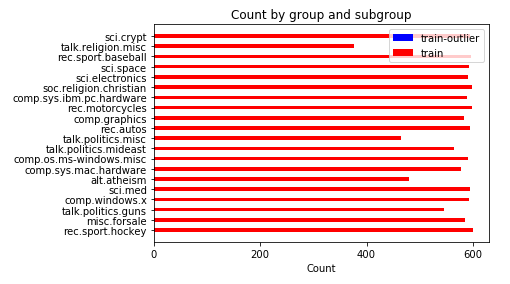
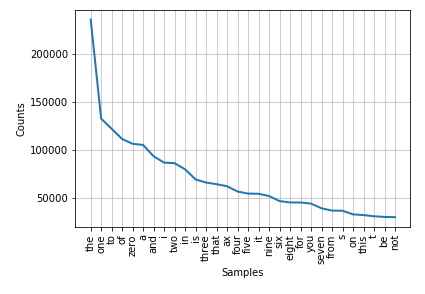
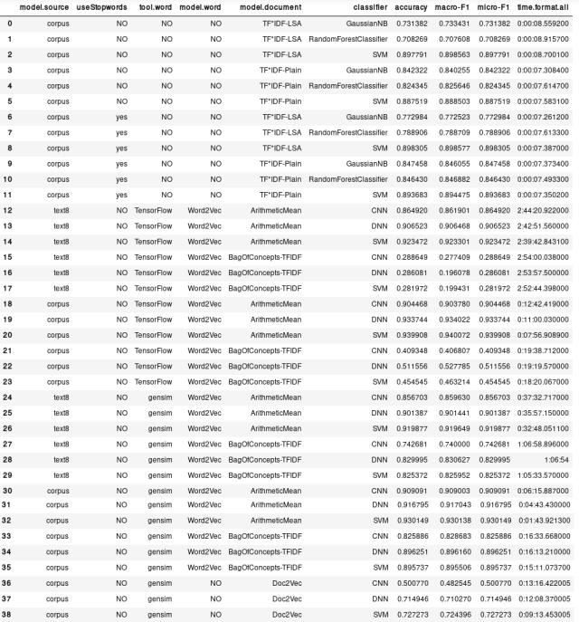

# 毕业项目：基于语料 *20 Newsgroups* 的自动文档分类系统设计

[TOC]

## I. 问题的定义

### 1. 项目概述

。。。

### 2. 问题陈述

本项目将试图创建一个文本分类系统，最终能对来自语料 *20 Newsgroups* 数据集的测试集上、共计 20 个类别的文本进行正确的归类。具体而言，创建文本分类系统主要包括：

1. 选择合适的文本表示模型。待选的表示模型包括词袋模型（Bag-of-Words）、词嵌入模型（Word Embedding），这两种方法都会对输入的文本进行一定处理，输出为数据形式，以便后续使用。
2. 选择合适的分类器。从机器学习的角度看，该项目是典型的有监督学习问题，待选的分类器包括支持向量机（SVM）、高斯朴素贝叶斯（Gaussian Naive Bayes）、随机森林（Random Forest）、普通深度神经网络（DNN）、卷积神经网络（CNN），任一指定的分类器都将从上一步骤中获得的数据进行训练（即机器学习）。训练后的分类器将可直接用于分类。

由于待训练文本总计有超过 18,000 条，考虑项目的执行环境，若直接在全数据集上进行完整的研究，预计对运行时间、存储空间的要求较高。因此本项目将分为 4 个阶段来进行：

1. 在随机选定的 5 个分类上进行小规模试验，以缩小研究范围
2. 基于对 5 分类小试的分析，创建一个在 20 分类上进行文本分类的基准模型
3. 基于对 5 分类小试的分析、20 分类上的基准模型试验，选择 3 种文本分类系统（即表示模型、分类器等的组合）进一步调节参数、改善效果
4. 使用测试集验证步骤 3 中得到的文本分类系统的效果

## 3. 评估指标

综合考虑下述 3 个指标：

+ $F_{1}$：$F_{1} = \frac{2PR}{P+R}$
+ $t_{all}$：所有训练耗时，为表示模型建模时间、分类器训练时间、实际分类（测试）时间三者之和

我希望训练得到一个分类效果较好、且总体建模时间相对较短的分类器。显然，$t_{all}$ 的意义较容易理解；而使用 $F_{1}$ 衡量的意义则在于，同时考虑了查准率（Precision） $P = \frac{TP}{TP + FP}$（实际为真、预测为真的样本，占所有预测为真的样本的比例） 与查全率（Recall） $R = \frac{TP}{TP + FN}$（实际为真、预测为真的样本，占所有实际为真的样本的比例），从而在这两个矛盾的指标上取得一定的平衡，平衡方式是给予两个指标同等权重。

## II. 分析

### 1. 数据的探索

问题中涉及的数据集包括下述 2 份：text8，*20 Newsgroups*。以下分别探索下述两个数据集

#### 1.1 [text8]

##### 1.1.1 数据来源

这是 gensim 在训练 word2vec 中[所建议的一份数据](https://radimrehurek.com/gensim/models/word2vec.html#gensim.models.word2vec.Text8Corpus)。这是一份[对原始的英文维基百科于 2006 年 3 月 3 日的 dump 文件进行清洗后得到的数据](http://www.mattmahoney.net/dc/textdata.html)。

> 具体的清洗步骤，将在第 7 部分（设计大纲）中进行说明

##### 1.1.2 数据特征

text8 数据集具备下述特征

1. 文本中只包含：由小写字母 a-z 组成的单词、单一空格（将不在 a-z 之间的字符也一律转换为空格）
2. 也就是说，text8 中的文本对于后续工作而言已经比较干净
3. 词库中包含 17005207 个单词

该数据将用于训练词向量（词袋模型的离散型词向量，或词嵌入模型的连续型词向量），从而实现对文本数据的规范表示。（这也是上述第 2 点中提到的「后续工作」）

##### 1.1.3 样本展示

如下为 text8 中前 200 字节：

```
 anarchism originated as a term of abuse first used against early working class radicals including the diggers of the english revolution and the sans culottes of the french revolution whilst the term
```

#### 1.2 [20 Newsgroups]

##### 1.2.1 数据来源

已经有学者已经[将 18000 条新闻文本分为 20 类主题](http://www.qwone.com/~jason/20Newsgroups/)，并提供了多种版本的新闻包以便下载。本项目中选取了其中[经过整理、分割为训练集与测试集的新闻包](http://www.qwone.com/~jason/20Newsgroups/20news-bydate.tar.gz)。

##### 1.2.2 数据特征

*20 Newsgroups* 具备如下特征：

+ 每条新闻均被研究人员标注为 20 个主题中的 1 个（即任何样本的分类都是单一的）
+ 总数据集包含 18846 条新闻，总共被分割为 2 个子集：
    + 训练集（占总数据 60%）
    + 测试集（占总数据 40%）
+ 剔除了跨主题的新闻（即任何一份新闻都只在单一主题下），提出了新闻组相关辨认标识（如 Xref, Newsgroups, Path, Followup-To, Date）
+ 对于文本处理而言仍不够干净：除了由小写字母 a-z 组成的单词、单一空格以外，还有一些标点符号，如 `@`、`.`、`*` 等。因此在最终训练前，需要对该数据进行清洗。

#### 1.2.3 样本展示

如下为其中的一份训练样本：

```txt
Organization: University of Illinois at Chicago, academic Computer Center
From: <U19250@uicvm.uic.edu>
Subject: Re: Foreskin Troubles
Lines: 3

This is generally called phimosis..usually it is due to an inflammation, and ca
n be retracted in the physician's offfice rather eaaasily.  One should see a GP
, or in complicated cases, a urologist.
```

如下为其中的一份测试样本：

```txt
Subject: CALCIUM deposits on heart valve
From: john.greze@execnet.com (John Greze)
Distribution: world
Organization: The Executive Network Information System
Lines: 6


A friend, a 62 year old man, has calcium deposits on one of his
heart valves .   What causes this to happen and what can be done about
it?

John.Greze@execnet.com
```
### 2. 探索性可视化

以下对语料 *20 Newsgroups* 进行可视化。数据集在 20 类别上的数据如下图所示：


我们可以看到有大约 3 个类的文本相对其他类来说明显较少，不过也可以看到：以训练集数据为例，这些类别大约都有 400 份数据，大约占大多数训练数据量的 66.67%。要判断这样的不均衡是否可接受，我们还要看看各类别中测试数据占训练数据的比例：


可以看到每个类别内部，测试数据与训练数据的比重非常稳定，正如数据提供者所说的，原始数据中训练数据大约占了 60%，测试数据占了 40%，该说法正好与图上的统计数据吻合。因此各分类内部没有明显的数据不均衡现象，均可用于正常的训练和测试。

项目将采用训练集来训练文本分类器，使用测试集来最终评估分类器的效果。由于训练时是依次读入文本的，而相邻的文本大多具备相同类别，除了那些在交界处的文本（即本类别内最后一份文本、下一类别的第一份文本）。为了避免分类器训练时倾向于后出现的类别，需要在训练前打乱训练数据。

考虑到各种特殊符号（例如：标点符号、换行符等）与单词的组合可能会使训练量过大，因此需要在正式训练前对文本进行预处理，即使用在 [text8 数据提供者提供的清洗 Wikipedia dump 的脚本](http://mattmahoney.net/dc/textdata) 基础上修改过的脚本，同样对 *20 Newsgroups* 数据集进行处理：清除其他所有字符，只保留由小写字母 a-z 组成的单词、单一空格（将不在 a-z 之间的字符也一律转换为空格）。处理之后，对各文档进行词汇量统计，可视化结果如下：


可以看到在共计 18846 份文本中，大部分文本的词汇量在 0-6699 之间，最多为 33449，最少为 12。词汇量超过 6699 的文本为 59 份，占比约为 0.0031，不足 0.5%。同时，列出这 59 份文本在各类别中的分布图（分别列出测试集与训练集中异常点的分布图）：




显然即便分散到各个分类中，所占比例仍然极小，肉眼不可见。列出其具体分布如下表：


可以看到：最多的异常点分布在训练集的 `comp.os.ms-windows.misc` 分类中。这些异常点占该部分数据的比例为：


显然，仍然只占对应数据集约 3%。因此可以放心地认为：从而先验地认为这些数据不足以对结果产生足够坏的影响，因此不予移除。

统计显示，经清洗的文本含有 6095997 个单词。显然，若要建立词袋模型，为避免出现维度灾难（特征数目过大导致算法性能大幅下降）或耗费计算资源过多，需要考虑去除掉一些过分频繁出现的词汇，并人为限制特征向量的维度。为验证该想法，首先列出文本中最常见的 30 个单词如下图所示：



可以看到这些单词对于分类而言几乎不具备意义，例如 the、to、of 等。如果最终选择以词袋模型作为 *20 Newsgroup* 分类系统的表示模型，像这些词语，可以考虑在建立表示模型时作为「停用词」（[stop words](https://en.wikipedia.org/wiki/Stop_words)）被剔除，从而减少词袋的维度、减少计算量，这有可能优化算法性能；具体是否有效果，可通过后续实验研究得知。

### 3. 算法和技术

这里主要探讨文本预处理后的文本表示模型算法、分类算法及相关技术。关于数据预处理，将在本文「III. 方法」中的「1. 数据预处理」提及。

#### 3.1 表示模型算法

本项目试图尝试的表示模型算法有 2 大类，共 4 种：

1. 基于词袋（Bag-of-Words）的表示模型
    1. 普通的词袋基础上，使用 TF\*IDF 矩阵表示文档。以下称 `BOW+TF*IDF`
    2. 在 1. 的基础上，对文档矩阵进行潜在语义分析（Lament Semantic Analysis, LSA）。以下称 `BOW+TF*IDF+LSA`
2. 基于词向量（词嵌入，word embedding）的表示模型：Word2Vec
    1. 词向量均值表示法。以下称 `ArithmeticMean`
    2. 基于概念袋（Bag-of-Concepts）表示法的 `TF*IDF` 模型。以下称 `Bag-of-Concepts+TF*IDF`
3. 基于文档向量（Paragraph Vector）的表示模型：Doc2Vec

以下分别简要介绍。

##### BOW+TF\*IDF

最简单直接的文档表示方法是词袋模型（Bag-of-Words, BOW）：

1. 基本的词袋（`BOW`）：所有可能出现的词 $w_i$ 占据一个独立的特征维度 $d_i$；任意一篇文章 $P$ 用一个向量 $x_P$ 来表示，当该文章 $P$ 拥有词 $w_i$ 时，则 $x_P$ 在维度 $d_i$ 上取值为 1，否则为 0。
2. 词袋 + 词频-逆文档频率（`BOW+TF*IDF`）：即本项目将尝试的模型。它与纯粹的 `BOW` 的区别在于：`BOW+TF*IDF` 在表示文章 $P$ 与词汇 $w_i$ 的关系时，若 $P$ 包含 $w_i$，则 $x_P$ 在 $d_i$ 上的取值为该词的 `TF*IDF` 值，详见[英文维基百科条目]((https://en.wikipedia.org/wiki/Tf–idf))。其中，
    1. `TF` 指「词频」，衡量该词在某篇文档中出现的频繁程度。其含义取决于具体实现，有单纯对词语 $w_i$ 计数的算法，即英文维基百科中提到的「raw count」；也有计算频率的算法，也就是计算 $w_i$ 在 $P$ 中的出现次数占所有词语在 $P$ 中出现次数的比例，即英文维基百科中提到的「term frequency」。本文选用的 scikit-learn 工具包[采用了前者的算法](http://scikit-learn.org/stable/modules/feature_extraction.html#tfidf-term-weighting)，即「raw count」
    2. `IDF` 即「逆文档频率」，衡量对于从文档集 $\{P\}$ 中区分出 $P$ 来说，$w_i$ 的重要程度；无论具体选择何种实现，当含有 $w_i$ 的文档数相对总文档数越少时，$w_i$ 越重要，当 $w_i$ 在越多的文档中出现，其显得越平庸、越不重要。本文选用的 `IDF` 算法是平滑的，即：$idf(t) = log\frac{1+n_{d}}{1+df(d, t)} + 1$，其中 $n_{d}$ 表示文档总数，$df(d, t)$ 表示含有词语 $t$ 的文档 $d$ 的数量。

##### BOW+TF\*IDF+LSA

基本的词袋模型简单易懂，包括 `TF*IDF` 的思想也容易理解。然而这种模型至少存在 3 个问题：

1. 维度过大：导致计算量太大
2. 噪音太多：有一些信息对于分类而言完全没必要
3. 过分稀疏：词袋表示几乎完全无法体现词汇意义之间的关联

[潜在语义分析（Lament Semantic Analysis, LSA）](https://en.wikipedia.org/wiki/Latent_semantic_analysis)的数学本质是对任意 $m \times n$ 阶矩阵 `X` 进行 k 阶[奇异值分解（SVD）](https://en.wikipedia.org/wiki/Singular_value_decomposition)（在进行 SVD 时，选取最大的 k 个奇异值），获得 `X` 的 k 阶近似矩阵（矩阵形状仍为 $m \times n$）。从而一定程度上解决上述 3 个问题。

##### 基于词向量 Word2Vec 的文档表示模型

类似上一节提到的 `BOW+TF*IDF+LSA` 试图解决传统的词袋模型的 3 个问题，另外有一种思路则不基于「计数」（如传统的词袋模型），而是试图直接为每个单词学习一些参数，参数量远低于词汇量，再用这些参数值表达的词汇来表达文档。

与传统词袋模型不同，词嵌入（词向量）模型中的 Word2Vec 模型，采用无监督学习算法，对每个词语学习一定数目的参数，用这些参数来表示词语。这种算法基于一种简单的思想，即：在相似上下文中出现的词语具有相似的意思；所谓「上下文」，即邻近目标词前后位置的若干词。

Word2Vec 在计算嵌入的参数时有 2 种算法：Skip-gram（从目标词预测上下文） 和 CBOW（从上下文预测目标词）。由于时间有限，而 TensorFlow 官方提供的 Word2Vec 版本（包括[原始版本](https://github.com/tensorflow/models/blob/master/tutorials/embedding/word2vec.py)和[优化版本](https://github.com/tensorflow/models/blob/master/tutorials/embedding/word2vec_optimized.py)）提供了 Skip-gram 方法的实现，为节省时间，本文选用了 Skip-gram 方法。同时，在使用 TensorFlow 官方提供的 Word2Vec 训练程序时，采用了[优化版本的 Word2Vec TensorFlow实现](https://github.com/tensorflow/models/blob/master/tutorials/embedding/word2vec_optimized.py)，其中使用负采样（Negative Sampling）技术计算损失函数，使用随机梯度下降（Stochastic Gradient Descent，SGD）来寻找损失函数的最优解。

理论上，使用 Word2Vec 训练出的模型，在[词语联想预测任务](https://www.tensorflow.org/tutorials/word2vec#evaluating_embeddings_analogical_reasoning)上将表现良好，例如能够探测到 $ king - queen \approx father - mother$这样的关系。

词向量训练完毕后，需要对这些词向量进行一定的组合与处理，从而得到基于词向量的文档表示。受文献[《基于 Word2Vec 的一种文档向量表示》](http://www.jsjkx.com/jsjkxen/ch/reader/create_pdf.aspx?file_no=20160643)、 [Convolutional Neural Networks for Sentence Classification](http://www.aclweb.org/anthology/D14-1181)、[A New Approach to Embedding Semantic Link Network with Word2Vec Binary Code](http://ieeexplore.ieee.org/document/7429351) 的启发，本项目选用了两种利用词向量表达文档的方法：

1. 对于每一篇文档，遍历其中所有词语，将这些词语的词向量进行相加；若遇到未学习过的词语，则加上固定的常量替代，例如零向量。最后，将得到的和向量对文章中的已学词语数求均值，用这样得到的均值向量来表示文档，即上文提到的 `ArithmeticMean` 方法
2. 由于 Word2Vec 模型擅长预测词语间的关系，因此可以对相似的词语进行聚类，从而得到「概念」（concept），即我们可以认为所有相似的词都是围绕同一概念生成的。而每一篇文章可以表示为若干概念的集合，因此可以类似「词袋」而创建「概念袋」（Bag-of-Concepts）表示法：遍历文章中每个词语，对每个遇到的词，在其对应的概念的那个维度上增加计数。而受到 `BOW + TF*IDF` 方法的启发，也可以使用 `TF*IDF` 来衡量「概念袋」表示法中每个概念的重要程度，只要把「概念袋」的每个维度即每个「概念」视为一个「单词」，即可计算其 `TF*IDF` 值。这就是上文提及的 `Bag-of-Concepts + TF*IDF` 方法

。。。补图

##### 基于文档向量（Paragraph Vector）的表示模型：Doc2Vec

[Doc2Vec 也是一种嵌入模型](https://cs.stanford.edu/~quocle/paragraph_vector.pdf)，借鉴了 Word2Vec 的训练思想。区别在于：在训练过程中需要在给定输入的情况下计算（预测）输出时，同时考虑了目标词的上下文词汇（同时学习到词汇的参数），以及当前训练文本的标签即文本类别名（同时学习到文档向量的参数）。类似地，Doc2Vec 也分为两种训练方法：PV-DM（类似 Word2Vec 的 CBOW 方法，使用上下文预测目标词） 与 PV-DBOW（类似 Word2Vec 的 Skip-gram 方法，使用目标词预测上下文）。考虑到原始论文中的建议（「[PV-DM alone usually works well for most tasks](https://cs.stanford.edu/~quocle/paragraph_vector.pdf)」），本项目中选用了默认的 PV-DM 方法来训练文档向量。

。。。补图。。。。

#### 3.2 分类算法

本项目试图尝试的分类算法有 2 大类，共 5 种：

1. 传统机器学习算法
  1. 支持向量机（Support Vector Machine, SVM）
  2. 高斯朴素贝叶斯（Gaussian Naive Bayes, GaussianNB）
  3. 随机森林（Random Forest）
2. 神经网络算法
  1. 普通多层神经网络（Deep Neural Network, DNN）
  2. 卷积神经网络（Convolutional Neural Network, CNN）

以下简单介绍各方法的优缺点：

1. SVM
  + [优点](https://mp.weixin.qq.com/s?__biz=MzA5ODUxOTA5Mg==&mid=2652549761&idx=1&sn=a51404d92418a25b3a2389cd35fffad7&scene=24&srcid=0828KO5LOZDyi8wXi9tsM3N2&pass_ticket=sjY%2BX5DxmxBcEFvXQDXbNAoDfOWD6yDF7YnwYatGdmEyI3SLnzCPcYOZruYNmGft#rd)：
    - 可以解决高维问题，即大型特征空间
    - 能够处理非线性特征的相互作用
    - 无需依赖整个数据集，[因此不需要太大内存](http://www.36dsj.com/archives/35477)
  + [缺点](https://mp.weixin.qq.com/s?__biz=MzA5ODUxOTA5Mg==&mid=2652549761&idx=1&sn=a51404d92418a25b3a2389cd35fffad7&scene=24&srcid=0828KO5LOZDyi8wXi9tsM3N2&pass_ticket=sjY%2BX5DxmxBcEFvXQDXbNAoDfOWD6yDF7YnwYatGdmEyI3SLnzCPcYOZruYNmGft#rd)
    - 当观测样本很多时，效率并不是很高
    - 对非线性问题没有通用解决方案，有时候很难找到一个合适的核函数
    - 对缺失数据和噪声敏感
2. GaussianNB
  + [优点](https://mp.weixin.qq.com/s?__biz=MzA5ODUxOTA5Mg==&mid=2652549761&idx=1&sn=a51404d92418a25b3a2389cd35fffad7&scene=24&srcid=0828KO5LOZDyi8wXi9tsM3N2&pass_ticket=sjY%2BX5DxmxBcEFvXQDXbNAoDfOWD6yDF7YnwYatGdmEyI3SLnzCPcYOZruYNmGft#rd)
    - 生成模型，收敛速度比判别模型（如上文的 SVM 和下文的 RandomForest）快
    - 对小规模的数据表现很好，能个处理多分类任务
    - 对缺失数据不太敏感，算法也比较简单，常用于文本分类
  + [缺点](https://mp.weixin.qq.com/s?__biz=MzA5ODUxOTA5Mg==&mid=2652549761&idx=1&sn=a51404d92418a25b3a2389cd35fffad7&scene=24&srcid=0828KO5LOZDyi8wXi9tsM3N2&pass_ticket=sjY%2BX5DxmxBcEFvXQDXbNAoDfOWD6yDF7YnwYatGdmEyI3SLnzCPcYOZruYNmGft#rd)
    - 先验地假设了各特征服从于高斯分布（正态分布），而这一假设未必在现实中成立
    - 对输入数据的表达形式很敏感
    - 是朴素贝叶斯分类器的一种，「朴素」的假设忽略了词序，而该信息对于文本分类可能是有用的
3. RandomForest
  + 优点
    - 比起单棵决策树，减少了过拟合
    - 容易实现，计算开销小
  + 缺点
    - 不如单棵决策树容易解释
    - 属于 Bagging 方法，主要关注降低方差而非偏差
4. DNN
  + 优点
    - 特别适合于处理语言、图像等非结构化数据，性能优越
    - 适合多种类型的数据处理
  + 缺点
    - 缺乏严格的理论基础，「黑箱」模型，难以解释
    - 容易过拟合
    - 计算量比一般分类器大
5. CNN
  + 优点
    - 比一般的多层神经网络层数更多，「容量」更大的情况下仍能限制计算开销，从而能处理更复杂的模型、完成更复杂的学习任务
    - 减少人工特征工程耗时
  + 缺点
    - 仍属于「黑箱」模型，难以解释
    - 计算量比一般分类器大

#### 3.2 技术

本项目使用了下述工具：

1. [scikit-learn 机器学习工具包](http://scikit-learn.org/stable/)：用于建立基于词袋的模型 `BOW+TF*IDF`、`BOW+TF*IDF+LSA`，并用于训练分类器 `SVM`、`GaussianNB`、`RandomForest`
2. [TensorFlow](https://www.tensorflow.org)：用于训练词向量 Word2Vec 模型（使用 Skip-gram 方法）
3. [gensim](https://radimrehurek.com/gensim/)：用于训练词向量 Word2Vec 模型（使用 Skip-gram 方法）、Doc2Vec 模型（使用 PV-DM 方法）
4. [NLTK](http://www.nltk.org/)：用于选出常用词，以便在建立词袋模型需要剔除单词时使用

各模型的参数将在后续实验中陆续确定。

### 4. 基准模型

#### 4.1 基准模型概述

目前已经有许多研究者在 *20 Newsgroups* 的数据集上进行了研究，但对于性能的衡量大多没有提及时间。本项目感兴趣的性能指标包括训练效果的 $F_{1}$ 与训练耗时 $t_{all}$，并首先考虑 $F_{1}$。其中：

+ F1：$F_{1} = \frac{2PR}{P+R}$，其中同时考虑了查准率（Precision） $P = \frac{TP}{TP + FP}$ 与查全率（Recall） $R = \frac{TP}{TP + FN}$
+ $t_{all}$ 同时包括建立表示模型的时间 $t_{model}$、分类器训练时间 $t_{train}$、实际分类耗时 $t_{test}$ 之和。

我希望训练得到一个训练速度和实际工作速度都较好的分类器。无论是表示模型建模时间 $t_{all}$ 、分类器训练耗时 $t_{train}$、实际使用时耗时 $t_{test}$ 任何一样太长，还是训练耗时 $t_{train}$ 较短、实际使用时耗时 $t_{test}$ 太长，都不是太好的模型。

另外，本项目感兴趣的组合方式较多，若直接在整个数据集上尝试所有模型并进行调优，将耗费过多时间；在时间有限的情况下，本项目将首先在部分数据集上进行一些试验，从中筛选出少数更可行的方案，一方面，在其中挑选出一个模型在完整的 20 分类数据集上进行一次分类，作为后续调优进行比较的基准；另一方面，使用筛选出的这些方案，最终在整个数据集上进行分类任务。

#### 4.2 筛选方案

首先，对于基于词袋的模型 `BOW+TF*IDF` 与 `BOW+TF*IDF+LSA`，使用 scikit-learn 工具包建模并训练分类器。

对于 Doc2Vec 模型，使用 gensim 建模；对于 Word2Vec 模型，分别使用 gensim 和 TensorFlow 建模，分别使用待学习语料和 text8 建模。然后，对于这两种嵌入模型，使用 scikit-learn 训练 SVM 分类器，使用 TensorFlow 训练 DNN 与 CNN 分类器。

总而言之，，待筛选方案如下：

建模语料 | 建模工具 | 词汇模型 | 文档模型(\*) | 分类器 
--------|---------|---------|--------|---------
原始语料（corpus） | scikit-learn | NO | `TF*IDF-Plain`, `TF*IDF-LSA` | SVM, GaussianNB, RandomForest
原始语料（corpus）,text8 | gensim, TensorFlow | Word2Vec | `ArithmeticMean`, `BagOfConcepts-TFIDF` | SVM, DNN, CNN
原始语料（corpus） | gensim | Doc2Vec | Doc2Vec | SVM, DNN, CNN

（\*）注：

1. `TF*IDF-Plain` 表示没经过 `LSA` 处理的 `BOW+TF*IDF` 模型
2. `ArithmeticMean` 表示文档的均值向量表示法（在 Word2Vec 为每个学习到的词嵌入了参数的基础上）

该表格的意思是：对于每一行，可从每一列中任选一种值，形成组合。例如：对于第二行而言，`text8 + gensim + Word2Vec + ArithmeticMean` 和 `corpus + TensorFlow + Word2Vec + BagOfConcepts-TFIDF` 都是可选的组合方式。则根据这种方式，总共有 $2 \times 3 + 2 \times 2 \times 2 \times 3 + 1 \times 3 = 33$ 种组合方式。各模型与分类器的参数未细调，仅为了初步查看效果而设置，因此不详细解释；若最终选用了相应组合时，后文将具体解释暂未说明清楚的参数。暂列举主要参数如下：

模型类别 | 模型名称 | 主要参数设置
--------|---------|------------
文本表示模型（文档） | `BOW+TF*IDF` | 特征数目：784。当去除停用词时，去除由 NLTK 挑选出的最常见的 30 个词
文本表示模型（文档） | `BOW+TF*IDF+LSA` | 除了保持 `BOW+TF*IDF` 的特点外，LSA 的参数是：迭代次数：10；随机数种子 19，选用最大的 200 个奇异值
文本表示模型（词汇） | `corpus + gensim + Word2Vec` | 特征数目：784。迭代次数：15。使用 Skip-gram 方法，词窗口大小为 5（即：对某个词而言，「上下文」指该词前 2 个单词与该词后 2 个单词），使用 12 个线程（实际上使用了所有物理核）来训练
文本表示模型（词汇） | `text8 + gensim + Word2Vec` | 参数同 `corpus + gensim + Word2Vec`
文本表示模型（词汇） | `corpus + TensorFlow + Word2Vec` | 特征数目：784。迭代次数：15。
文本表示模型（词汇） | `text8 + TensorFlow + Word2Vec` | 参数同 `corpus + TensorFlow + Word2Vec`
文本表示模型（文档） | `ArithmeticMean` | 当遇到未学过的单词时，加上 784 维的零向量
文本表示模型（文档） | `BagOfConcepts-TFIDF` | 使用修改过的 KMeans 算法，使用余弦距离而非欧氏距离来聚类
文本表示模型（文档） | `Doc2Vec` | 初始学习率 0.025，最低学习率 0.005 
分类器 | SVM | 线性核，其余参数默认
分类器 | DNN | 1 个隐藏层，隐藏层结点数：512。使用 ReLU 作为激励函数（TensorFlow 代码中说明：[不指定时，默认使用 ReLU](https://github.com/tensorflow/tensorflow/blob/r1.1/tensorflow/contrib/learn/python/learn/estimators/dnn.py#L81)）
分类器 | CNN | 完全参考 TensorFlow 官方的 [Deep MNIST for Experts](https://www.tensorflow.org/get_started/mnist/pros) 参数设置，主要列举如下：采用 SAME 填充（滤波器移动时为了保证移动整数个步长，在矩阵外围填充 0），使用 $2 \times 2$ 最大池化填充，训练时为防止过拟合而设置的 dropout 使用 0.5，使用 ReLU 作为激励函数，2 层卷积层（patch 数分别为 64 与 32），全连接层结点数为 1024。

所有这些组合方式在随机选取的 5 个分类（试验中为：`comp.windows.x`、`rec.sport.hockey`、`sci.crypt`、`sci.electronics`、`talk.politics.guns`）上进行试验，结果为：



可以看到除了 16、17 两种组合外，其余的组合中，`macro-F1` 与 `micor-F1` 差距并不大。以 `macro-F1` 为指标，筛选出超过 0.8 的组合为：


从表上可以看到 `macro-F1` 占前 3 的组合为：

1. `corpus + TensorFlow + Word2Vec + ArithmeticMean + SVM`（ID:20）
2. `corpus + TensorFlow + Word2Vec + ArithmeticMean + DNN`（ID:19）
3. `corpus + gensim + Word2Vec + ArithmeticMean + SVM`（ID:32）

因此，选用这 3 种组合完成最终的 20 分类任务。

#### 4.3 确定基准模型

「4.2 筛选方案」中确定了 3 种方案。考虑到训练效果差异可能随着数据规模扩大而不同，因此，对上述 3 种方案均进行了测试，结果为：


可以看到确实出现了变化： 以 `macro-F1` 为指标，`corpus + gensim + Word2Vec + ArithmeticMean + SVM` 的分类效果超过了 `corpus + TensorFlow + Word2Vec + ArithmeticMean + DNN`，且前者耗时远少于后者。从这三组数据可以认为：上述参数设置下的 `corpus + TensorFlow + Word2Vec + ArithmeticMean + DNN` 组合为基准模型，预计最终实际训练出的模型在 `macro-F1` 上的得分（按百分比计）应高于 74.64。另外，若从训练时间上来看，考虑到提升词嵌入模型的训练效果可能需要增加迭代次数，因此，预计三组模型的实际训练时间应分别高于该表所示，但预计耗时排序不会有太大变化。

## III. 方法

### 1. 数据预处理

首先使用在 [text8 数据提供者提供的清洗 Wikipedia dump 的脚本](http://mattmahoney.net/dc/textdata) 基础上修改过的脚本对原始的[经过整理、分割为训练集与测试集的 *20 Newsgroups* 新闻包](http://www.qwone.com/~jason/20Newsgroups/20news-bydate.tar.gz)进行清洗。相比原始脚本，修改地方为：注释掉 `while (<>) {`以下 3 行以使其不起作用，并在 `while (<>) {` 下第 4 行加入了 `{`。修改原因是：原始脚本是为了清洗来自 Wikipedia dump 的 HTML 数据，而这里的 *20 Newsgroups* 数据是直白的文本，因此可直接将清洗过程应用到文本上。经修改的脚本如下：

```perl
#!/usr/bin/perl

# Program to filter Wikipedia XML dumps to "clean" text consisting only of lowercase
# letters (a-z, converted from A-Z), and spaces (never consecutive).  
# All other characters are converted to spaces.  Only text which normally appears 
# in the web browser is displayed.  Tables are removed.  Image captions are 
# preserved.  Links are converted to normal text.  Digits are spelled out.

# Written by Matt Mahoney, June 10, 2006.  This program is released to the public domain.

$/=">";                     # input record separator
while (<>) {
#  if (/<text /) {$text=1;}  # remove all but between <text> ... </text>
#  if (/#redirect/i) {$text=0;}  # remove #REDIRECT
#  if ($text) {
{
    # Remove any text not normally visible
    if (/<\/text>/) {$text=0;}
    s/<.*>//;               # remove xml tags
    s/&amp;/&/g;            # decode URL encoded chars
    s/&lt;/</g;
    s/&gt;/>/g;
    s/<ref[^<]*<\/ref>//g;  # remove references <ref...> ... </ref>
    s/<[^>]*>//g;           # remove xhtml tags
    s/\[http:[^] ]*/[/g;    # remove normal url, preserve visible text
    s/\|thumb//ig;          # remove images links, preserve caption
    s/\|left//ig;
    s/\|right//ig;
    s/\|\d+px//ig;
    s/\[\[image:[^\[\]]*\|//ig;
    s/\[\[category:([^|\]]*)[^]]*\]\]/[[$1]]/ig;  # show categories without markup
    s/\[\[[a-z\-]*:[^\]]*\]\]//g;  # remove links to other languages
    s/\[\[[^\|\]]*\|/[[/g;  # remove wiki url, preserve visible text
    s/\{\{[^}]*\}\}//g;         # remove {{icons}} and {tables}
    s/{[^}]*}//g;
    s/\[//g;                # remove [ and ]
    s/\]//g;
    s/&[^;]*;/ /g;          # remove URL encoded chars

    # convert to lowercase letters and spaces, spell digits
    $_=" $_ ";
    tr/A-Z/a-z/;
    s/0/ zero /g;
    s/1/ one /g;
    s/2/ two /g;
    s/3/ three /g;
    s/4/ four /g;
    s/5/ five /g;
    s/6/ six /g;
    s/7/ seven /g;
    s/8/ eight /g;
    s/9/ nine /g;
    tr/a-z/ /cs;
    chop;
    print $_;
  }
}

```

经过上述脚本清洗后的文本，将只剩下：由小写字母 a-z 组成的单词、单一空格（将不在 a-z 之间的字符也一律转换为空格；所有数字将也被转换为单词）。由 gensim 或 TensorFlow 编写的词向量训练器将直接在经过该脚本预处理后的文本上进行训练，以学到嵌入参数。

### 2. 执行过程

这里将首先使用 TensorFlow 与 gensim 分别建立上述「II. 分析 - 3. 算法和技术」中提到的 Word2Vec 模型（使用 Skip-gram 方法）；然后，使用平均向量法来表示文档；接着，在 TensorFlow 建立的模型上使用神经网络（DNN）与支持向量机（SVM）学习分类，在 gensim 建立的模型上使用支持向量机（SVM）学习分类；最后，在测试集上使用这 3 种分类系统来完成实际的分类任务。采用指标仍然是 $F_{1}$（这里采用 `macro-F1`）与 $t_{alll}$（包括以下三者之和：建模时间，训练时间，实际训练时间即评估时间）。

对于 DNN 与 CNN，由于 TensorFlow 本身的输入格式要求，在将数据喂给分类器进行学习前，需要先对标签进行独热向量表示（One-hot representation）处理。项目中使用了 `sklearn.preprocessing.LabelBinarizer`来完成这一任务。

在「II. 分析 - 4.3 确定基准模型」中已经展示了所选的 3 种方案的初步实现结果。下一步将进行参数细调，以达到更好的分类效果。

### 3. 完善

。。。删除
```
1. `corpus + TensorFlow + Word2Vec + ArithmeticMean + SVM`（ID:20）
2. `corpus + TensorFlow + Word2Vec + ArithmeticMean + DNN`（ID:19）
3. `corpus + gensim + Word2Vec + ArithmeticMean + SVM`（ID:32）
```
由于要构建的文本分类系统主要包含了「表示模型」核「分类器」两个部分，因此相应地，要改善结果，有 2 种思路：

1. 改善表示模型对文本的表示效果
2. 改善分类器对文本的分类效果

#### 3.1 改善表示模型

截取「II. 分析 - 4.2 筛选方案」部分表格如下：

模型类别 | 模型名称 | 主要参数设置
--------|---------|------------
文本表示模型（词汇） | `corpus + gensim + Word2Vec` | 特征数目：784。迭代次数：15。使用 Skip-gram 方法。词窗口大小为 5（即：对某个词而言。「上下文」指该词前 2 个单词与该词后 2 个单词）。线程数：12
文本表示模型（词汇） | `corpus + TensorFlow + Word2Vec` | 特征数目：784。迭代次数：15。线程数：12
文本表示模型（文档） | `ArithmeticMean` | 当遇到未学过的单词时，加上 784 维的零向量

对于表示模型，主要可考虑修改的参数为：

+ 词窗口大小
+ 特征数
+ 负采样时所采样的负样本数（下文称：负采样数）
+ 初始学习率

试验结果如下：

参数 | 表示模型训练工具 | 调整影响
----|----------------|---------
词窗口大小 | gensim |  
         | TensorFlow | 
特征数 | gensim | 
      | TensorFlow | 
负采样数 | gensim | 
        | TensorFlow | 
初始学习率 | gensim | 
         | TensorFlow | 


#### 3.2 改善分类器

截取「II. 分析 - 4.2 筛选方案」中部分表格如下：

模型类别 | 模型名称 | 主要参数设置
--------|---------|------------
分类器 | SVM | 线性核，其余参数默认
分类器 | DNN | 1 个隐藏层，隐藏层结点数：512。使用 ReLU 作为激励函数（TensorFlow 代码中说明：[不指定时，默认使用 ReLU](https://github.com/tensorflow/tensorflow/blob/r1.1/tensorflow/contrib/learn/python/learn/estimators/dnn.py#L81)）


## IV. 结果

### 1. 模型的评价与验证


### 2. 合理性分析


## V. 项目结论

### 1. 结果可视化


### 2. 对项目的思考


### 3. 需要作出的改进


## 主要参考文献

1. 西瓜书。。。
2. 李航。。。统计学习


---------------------

## 4. 解决办法

0. 【数据预处理】将待训练集和测试集的文本进行同样的清洗，即
    + 
1. 【特征抽取与文本表示】从文本数据集中抽取表示文本所需的特征，然后在文本数据集上用这些抽取出的特征重新表示文本数据集，包括
    + 使用**TF-IDF** 方法抽取特征，建立表示模型 1，包括如下步骤：
    + 使用**词嵌入**（Word embedding）方法（在这里，具体使用 Doc2Vec）抽取特征，建立表示模型 2
2. 【分类器训练】对已经建立的表示模型，在每个模型上分别使用一些有监督学习方法在训练数据上分别训练出一定数量的分类器，包括这 3 种分类器训练模型：
    + SVM（支持向量机）
    + 朴素贝叶斯分类器
    + 神经网络
3. 【性能评估】对上述分类器进行如下评估：
    1. 对于上述每种表示模型：比较同一文本表示模型下不同训练方法的训练效果
    2. 在每种表示模型的语境下各选出分类效果最好的那个分类器，并进行比较
    3. 评估指标见下


## 6. 基准模型

ch6

## 7. 设计大纲

ch7
